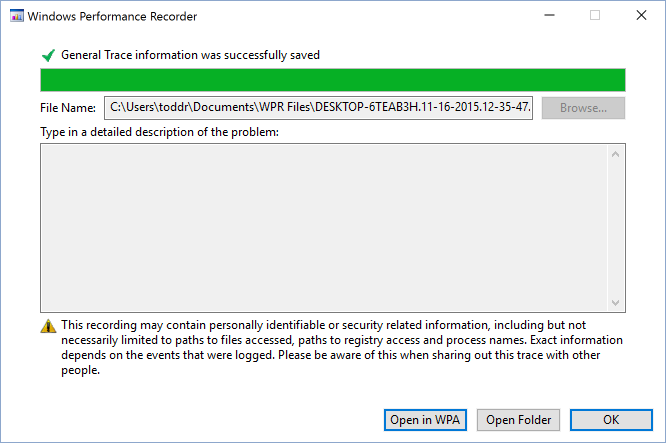
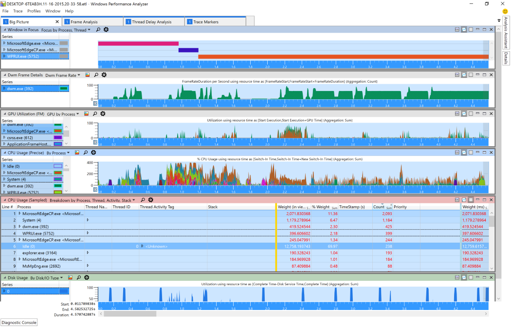

# Анализ производительностиPerformance Analysis  

Если вы не знаете о производительности, ознакомьтесь с руководством [F12 DevTools.](../devtools-guide/index.md)If you're new to performance, you should check out the [F12 DevTools guide](../devtools-guide/index.md).
Средства [F12, встроенные](../devtools-guide/index.md) в Microsoft Edge, можно использовать для анализа общей производительности веб-сайта.The [F12 tools](../devtools-guide/index.md) built into Microsoft Edge can be used to analyze the general performance of a web site.  Он предоставляет аналогичные (но более ограниченные) возможности производительности [Windows набор средств](/windows-hardware/test/wpt/index) прямо в браузере.It provides similar (but more limited) capabilities to the [Windows Performance Toolkit](/windows-hardware/test/wpt/index) from right within the browser.  

Если вы хотите провести более глубокий анализ производительности браузера, команда Microsoft Edge использует windows [Performance набор средств](/windows-hardware/test/wpt/index) (WPT).If you want a deeper analysis of browser performance, the Microsoft Edge team uses the [Windows Performance Toolkit](/windows-hardware/test/wpt/index) (WPT).  WPT был создан командой Windows для проведения подробного анализа производительности программы.WPT was created by the Windows team to conduct in-depth program performance analysis.  Он перестраивал границы между JavaScript веб-сайта и исходным кодом Microsoft Edge, позволяя просматривать оба этих кода в одном средстве.It straddles the boundaries between website JavaScript and Microsoft Edge native code, allowing both to be viewed within the same tool.  WPT можно использовать для:WPT can be used to:  

*   Измерение времени ЦП, необходимого программному обеспечению для завершения работыMeasure CPU time taken for software to complete work  
*   Расчет памяти, выделенной программным обеспечениемCalculate the memory allocated by software  
*   Показать сведения о загрузке файлов с удаленных серверовShow the details of downloading files from remote servers  
*   Измерение частоты кадров.Measure frame rate.  

Чтобы начать использовать windows Performance набор средств для анализа веб-сайта, сначала необходимо скачать комплект для развертывания и оценки [Windows 10 (ADK).](https://developer.microsoft.com/windows/hardware/windows-assessment-deployment-kit)To get started with using the Windows Performance Toolkit to analyze your website, you'll first need to download the [Windows 10 Assessment and Deployment Kit (ADK)](https://developer.microsoft.com/windows/hardware/windows-assessment-deployment-kit).  Выберите параметр *производительности Windows набор средств* во время установки:Select the *Windows Performance Toolkit* option during installation:  

  

Здесь мы описам, как записывать и анализировать трассировка производительности.Here we'll cover how to record and analyze a performance trace.  
Чтобы узнать больше о том, что включено в windows Performance набор средств, ознакомьтесь с полной документацией [по WPT.](/windows-hardware/test/wpt/index)To learn more about what's included in the Windows Performance Toolkit, check out the full [WPT documentation](/windows-hardware/test/wpt/index).  

## Запись трассировкиRecording a trace  

Затем настроите сценарий пользователя и подготовьтесь к сбору трассировки с помощью записи производительности Windows.Next, set up your user scenario and prepare to gather a trace using Windows Performance Recorder.  
Вот как профилировать веб-сценарий с помощью *записи производительности Windows (WPR).*Here's how to profile your web scenario with the *Windows Performance Recorder (WPR)*.  

### 1. Подготовка среды к сбору трассировки производительности1.  Prepare your environment to gather a performance trace  

Выключив как можно больше запущенных программ, чтобы избежать шума в трассирове, которую вы хотите записать.Shut down as many running programs as possible to avoid noise in the trace that you're about to record.  В идеале единственным работающим программным обеспечением будет Windows Performance Recorder (WPR) и браузер.Ideally, the only running software will be Windows Performance Recorder (WPR) and the browser.  

### 2. Запустите windows Performance Recorder (WPR) и выберите параметры2.  Launch Windows Performance Recorder (WPR) and select options  

Запустите windows Performance Recorder \*\*\*\* и убедитесь, что расширен параметр "Дополнительные параметры".Launch the Windows Performance Recorder and ensure that **More options** toggle is expanded.  Выберите *"Браузер Edge"* и *"Сценарий отклика HTML".*Select the *Edge Browser* and *HTML Responsiveness* scenario analysis checkboxes.  

  

#### Советы и рекомендации по сбору трассировокTips and tricks for gathering traces  

*   Старайтесь сохранить фоновую активность до абсолютного обязательного минимума.Try to keep background activity to an absolute required minimum.  Фоновые процессы могут подавлять воспринимаемую производительность и фактические характеристики производительности, а также влиять на результаты.Background processes may skew both perceived performance and actual performance characteristics and affect the results.  В идеале нет других запущенных приложений рядом с браузером и WPR.Ideally there are no other running applications beside browser and WPR.  
*   Определите сценарии, которые вы анализируете, и постарайтесь сохранить их как можно более атомарными.Identify the scenarios you're analyzing and try to keep them as atomic as possible.  Например, если у сайта возникают проблемы с производительностью при загрузке страницы, прокрутке и выборе чего-либо в таблице, разделите эти проблемы на три сценария:For example, if your site has performance problems when loading the page, scrolling, and selecting something in a table, separate the issues into three scenarios:  
    *   Загрузка страницы (от начала навигации до завершения загрузки страницы)Page load (from start of navigation to page load complete)  
    *   ScrollScroll  
    *   Выбор чего-либо в таблицеSelecting something in the table  
*   Если сценарий включает переход к сайту, рассмотрите возможность его начала с примерного:пустого.If a scenario involves navigating to a site, consider beginning the scenario at about:blank.  Начиная с about:blank, это позволит избежать накладных расходов на предыдущую страницу.Starting at about:blank will avoid the overhead of the previous page.  Если он подразумевает переход с сайта, перейдите к объекту about:blank, чтобы завершить сценарий.If it involves navigating away from a site, navigate to about:blank to complete the scenario.  Это позволит скрыть шум других сайтов от трассировки, если конкретное взаимодействие между сайтами не является проблемой, которая находится в стадии исследования.This will keep the noise of other sites out of the trace unless the specific interaction between sites is the issue under investigation.  

### 3. Зафиксировать сценарий3.  Record the scenario  

Нажмите **кнопку "Начните",** чтобы начать запись.Click **Start** to begin recording.  Средство сообщает размер буфера, который используется для прогнозирования размера сгенерируемого файла.The tool will report the size of the buffer it is using to help you anticipate the size of the generated file.  Выполните пользовательский сценарий, который \*\*\*\* необходимо измерить, а затем нажмите кнопку "Сохранить", чтобы остановить запись и сохранить трассировка.Perform the user scenario you want to measure, then click **Save** to stop the recording and save the trace.  Сохранение сразу после завершения сценария поможет свести к минимуму размер файла трассировки.Saving immediately after finishing your scenario will help minimize the size of the trace file.  

  

Средство WPR указывает, что данные трассировки успешно сохранены:The WPR tool will indicate that your trace information was saved successfully:  

  

## Анализ трассировкиAnalyzing a trace  

Теперь, когда вы собрали данные о производительности, вы можете проанализировать трассировщик с помощью анализатора производительности Windows, чтобы узнать, какие оптимизации можно провести.Now that you've gathered your performance data, you can analyze the trace using Windows Performance Analyzer to see what optimizations can be made.  
Вот как анализировать данные о производительности веб-сценария.Here's how to analyze your web scenario performance data.  

### 1. Откройте Windows Performance Analyzer (WPA)1.  Open Windows Performance Analyzer (WPA)  

Запустите анализатор производительности Windows и откройте файл для `.etl` анализа (**открытие**  >  **файла...**).Launch Windows Performance Analyzer and open the `.etl` file to be analyzed (**File** > **Open...**).  

### 2. Загрузка символов и применение *профиля анализа HTML*2.  Load symbols and apply the *HTML analysis* profile  

> [!WARNING]
> Загрузка символов в первый раз потребует большой загрузки и займет значительное количество времени при обычном под подключением к Интернету.Loading symbols for the first time will require a large download and will take a significant amount of time on a typical internet connection.  

Загрузите символы, \*\*\*\* выбрав в меню  >  **символы нагрузки** трассировки.Load your symbols by selecting **Trace** > **Load Symbols** from the menu.  Символы будут кэшться на диске, а последующие трассировки будут загружать символы гораздо быстрее.The symbols will be cached to disk and future traces will load symbols much faster.  

Вы можете загружать символы значительно быстрее, ограничивая загрузку Microsoft Edge и ведущим приложением веб-приложений.You can load symbols significantly faster by restricting the loading to Microsoft Edge and the web apps host.  Выберите \*\*\*\*  >  **"Настроить символы трассировки"** и ограничив параметры загрузки только и \*\*\*\* `MicrosoftEdgeCP.exe` `WWAHost.exe` .Select **Trace** > **Configure Symbols** and restrict the **Load Settings** to only `MicrosoftEdgeCP.exe` and `WWAHost.exe`.  

  

После начала загрузки символов примените *html-профиль анализа* **(применяются**  >  **профили...**  >  **Обзор каталога...**  >  **HtmlResponsivenessAnalysis.wpaProfile**)After symbols begin loading, apply the *Html Analysis Profile* (**Profiles** > **Apply...** > **Browse Catalog...** > **HtmlResponsivenessAnalysis.wpaProfile**)  
Профиль загрузит несколько графиков и таблиц для анализа.The profile will load several graphs and tables for your analysis.  Для практически всех исследований веб-сайтов рекомендуется начать с этого профиля.For nearly all website investigations, we recommend starting with this profile.  

  

#### Профиль анализа отклика htmlThe Html Responsiveness Analysis Profile  

Профиль *анализа отклика html* предоставляет четыре вкладки:The *Html Responsiveness* analysis profile provides four tabs:  

**"Большая картинка"** — это полезно для подтверждения того, что непредвиденных источников активности ЦП нет, и браузер действительно использует все доступные ресурсы.**Big Picture** - This is useful for confirming that there are no unexpected sources of CPU activity and the browser is indeed using all available resources.  Проверьте использование ЦП и убедитесь, что никакие процессы не вносят значительного вклада в использование ЦП, кроме браузера.Check your CPU usage and verify that no processes contribute significantly to CPU usage other than the browser.  

**Анализ кадров—** этот раздел используется для базового анализа.**Frame Analysis** - This section is used for basic analysis.  График *использования ЦП (присвоенный)* позволяет быстро понять подсистемы, отвечающие за использование ЦП.The *CPU Usage (Attributed)* graph enables a quick glance for understanding of the subsystems responsible for CPU usage.  Разбитие примеров в таблице использования ЦП *(sampled)* в *потоке пользовательского* интерфейса HTML полезно для определения критических узких места производительности.Breaking down the samples in the *CPU Usage (Sampled)* table on the *HTML UI Thread* is helpful for identifying critical performance bottlenecks.  

**Маркеры** трассировки — в этом разделе показаны все маркеры трассировки, которые приходят из браузера (Microsoft Edge), включая *msWriteProfilerMark,* которые предоставляют точные точки для измерения кода.**Trace Markers** - This section shows all tracing markers coming from the browser (Microsoft Edge), including *msWriteProfilerMark*, which provides precise points for measuring code.  Чтобы *просмотреть трассировку msWriteProfilerMark,* прокрутите вниз до графика  *"Универсальные* события" и выберите **HTML msWriteProfilerMark** в выпадаемом меню.To see *msWriteProfilerMark* tracing, scroll down to the  *Generic Events* graph and select **HTML msWriteProfilerMark** from the drop-down menu.  

**Анализ задержки потока** — эта вкладка часто используется разработчиками Microsoft Edge для изучения того, когда один поток блокируется и ожидает другого.**Thread Delay Analysis** - This tab is often used by Microsoft Edge developers to investigate when one thread is blocked and waiting on another.  В редких случаях это также может быть полезно для веб-разработчиков.On rare occasions it might also be useful to web developers.  

### 3. Масштабирование для удаления запуска трассировки3.  Zoom to remove trace rundown  

Вы можете сосредоточиться на анализе, удалив пустые разделы *rundown* трассировки в конце графиков.You can focus your analysis by removing the empty trailing *Trace Rundown* sections of your graphs.  На любом из графиков, на которых в настоящее время отображаются:From any of the graphs currently showing:  
*   Щелкните левой кнопкой мыши в начале данных графа, которые вы хотите изучитьLeft-click at the start of the graph data you wish to investigate  
*   Удержание, перетаскивания и освобождение для выбора нужной областиHold, drag and release to select the desired region  
*   Щелкните правой кнопкой мыши и выберите **"Масштаб"**Right-click and select **Zoom**  

Масштаб будет применяться к всем графикам и диаграммам на активной вкладке.The zoom will apply to all graphs and charts on the active tab.  

  

### 4. Изучение циклов ЦП4.  Investigate what's taking up CPU cycles  

 В **таблице "Использование ЦП (примеры) на** вкладке **"Анализ** кадров" большая часть анализа, скорее всего, будет происходить.The **CPU Usage (Sampled)** table in the **Frame Analysis** tab is where most of your analysis will likely happen.  Вы можете развернуть различные процессы, чтобы определить наиболее сложный код JavaScript и браузера.You can expand the various processes to identify the most compute intensive JavaScript and browser code.  Часто за проблему производительности отвечает один бит JavaScript, и оптимизация может существенно изменить его производительность.Often a single bit of JavaScript is responsible for a performance issue, and taking the time to optimize it can make a significant difference.  

### 5. Проявить любой медленно работающий код JavaScript5.  Drill into any slow-running JavaScript code  

Анализ вызовов DOM снизу вверх может быть полезен для определения JavaScript, который отвечает за большую часть времени в сценарии.Bottom up DOM call analysis can be useful for identifying the JavaScript responsible for taking up the majority of time during the scenario.  Это особенно полезно, если многие вызовы верхнего уровня повторно используют те же библиотеки JavaScript.This is especially helpful when many top level calls are re-using the same JavaScript libraries.  

Начните с анализа данных об использовании *ЦП (sampled) по процессу, потоку, действию, стеку.*Start by looking at *CPU Usage (Sampled) Breakdown by Process, Thread, Activity, Stack*.  Щелкните любую ячейку в **столбце Stack.**Click on any cell in **Stack** column.  Нажмите *CTRL+F* и нащите *externalFunctionThunk.*Press *Ctrl+F* and search for *ExternalFunctionThunk*.  

> [!NOTE] 
> Это работает, только если вы успешно загрузили символы.This only works if you have successfully loaded symbols.  

  

Изучите все строки *с помощью ExternalFunctionThunk.*Investigate any lines with *ExternalFunctionThunk*.  Это интерфейс от ядра JavaScript для Chakra до ядра Microsoft Edge.This is the interface from the Chakra JavaScript engine to the Microsoft Edge engine.  Здесь показано, где код мостит из браузера в выполнение JavaScript.It shows where code bridges from the browser to JavaScript execution.  Щелкните строку правой кнопкой мыши и выберите "Просмотреть вызываемую **по**модуле", чтобы просмотреть взвешовый список самых длинных функций  >  \*\*\*\* браузерного модуля.Right-click on the line and select **View Callees** > **By Module** to see a weighted list of longest running browser engine functions.  

  

Чтобы определить все javaScript, вызыватели определенного API, щелкните его правой кнопкой мыши и выберите "Просмотр вызывателей по \*\*\*\* функции" и разверните дерево, чтобы просмотреть и сравнить  >  \*\*\*\* относительные веса.To identify all the JavaScript calling a specific API, right-click on it and select **View Callers** > **By Function** and expand the tree to view and compare the relative weights.  
