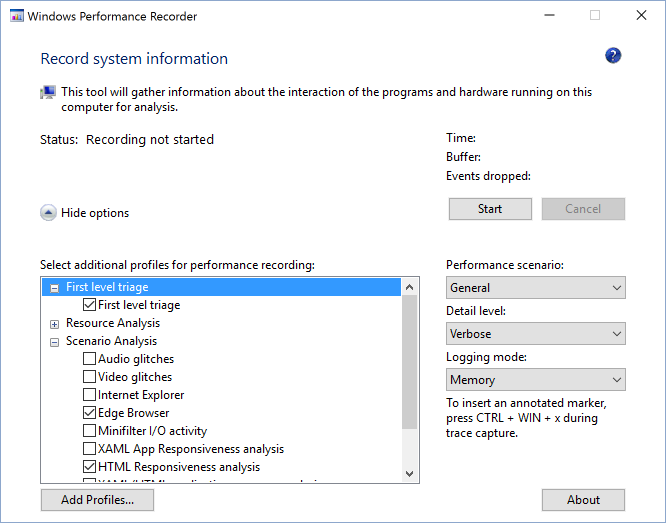
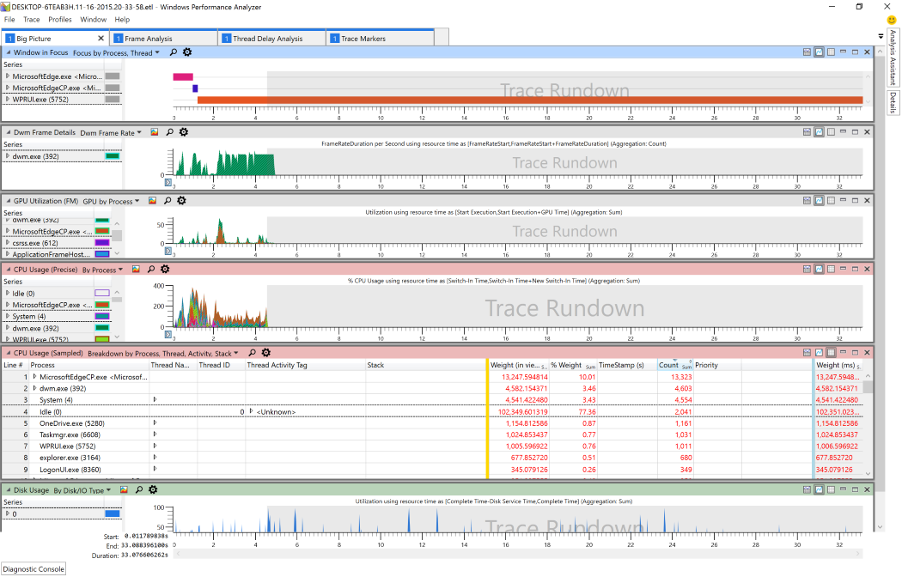
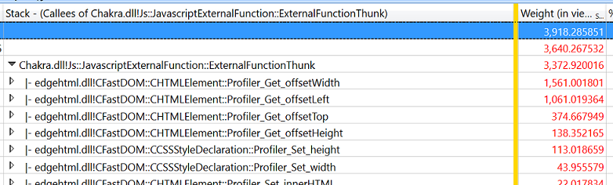

# Анализ производительности  

Если вы не знаете о производительности, ознакомьтесь с руководством [F12 DevTools.](../devtools-guide/index.md)
Средства [F12, встроенные](../devtools-guide/index.md) в Microsoft Edge, можно использовать для анализа общей производительности веб-сайта.  Он предоставляет аналогичные (но более ограниченные) возможности производительности [Windows набор средств](/windows-hardware/test/wpt/index) прямо в браузере.  

Если вы хотите провести более глубокий анализ производительности браузера, команда Microsoft Edge использует windows [Performance набор средств](/windows-hardware/test/wpt/index) (WPT).  WPT был создан командой Windows для проведения подробного анализа производительности программы.  Он перестраивал границы между JavaScript веб-сайта и исходным кодом Microsoft Edge, позволяя просматривать оба этих кода в одном средстве.  WPT можно использовать для:  

*   Измерение времени ЦП, необходимого программному обеспечению для завершения работы  
*   Расчет памяти, выделенной программным обеспечением  
*   Показать сведения о загрузке файлов с удаленных серверов  
*   Измерение частоты кадров.  

Чтобы начать использовать windows Performance набор средств для анализа веб-сайта, сначала необходимо скачать комплект для развертывания и оценки [Windows 10 (ADK).](https://developer.microsoft.com/windows/hardware/windows-assessment-deployment-kit)  Выберите параметр *производительности Windows набор средств* во время установки:  

  

Здесь мы описам, как записывать и анализировать трассировка производительности.  
Чтобы узнать больше о том, что включено в windows Performance набор средств, ознакомьтесь с полной документацией [по WPT.](/windows-hardware/test/wpt/index)  

## Запись трассировки  

Затем настроите сценарий пользователя и подготовьтесь к сбору трассировки с помощью записи производительности Windows.  
Вот как профилировать веб-сценарий с помощью *записи производительности Windows (WPR).*  

### 1. Подготовка среды к сбору трассировки производительности  

Выключив как можно больше запущенных программ, чтобы избежать шума в трассирове, которую вы хотите записать.  В идеале единственным работающим программным обеспечением будет Windows Performance Recorder (WPR) и браузер.  

### 2. Запустите windows Performance Recorder (WPR) и выберите параметры  

Запустите windows Performance Recorder **** и убедитесь, что расширен параметр "Дополнительные параметры".  Выберите *"Браузер Edge"* и *"Сценарий отклика HTML".*  

  

#### Советы и рекомендации по сбору трассировок  

*   Старайтесь сохранить фоновую активность до абсолютного обязательного минимума.  Фоновые процессы могут подавлять воспринимаемую производительность и фактические характеристики производительности, а также влиять на результаты.  В идеале нет других запущенных приложений рядом с браузером и WPR.  
*   Определите сценарии, которые вы анализируете, и постарайтесь сохранить их как можно более атомарными.  Например, если у сайта возникают проблемы с производительностью при загрузке страницы, прокрутке и выборе чего-либо в таблице, разделите эти проблемы на три сценария:  
    *   Загрузка страницы (от начала навигации до завершения загрузки страницы)  
    *   Scroll  
    *   Выбор чего-либо в таблице  
*   Если сценарий включает переход к сайту, рассмотрите возможность его начала с примерного:пустого.  Начиная с about:blank, это позволит избежать накладных расходов на предыдущую страницу.  Если он подразумевает переход с сайта, перейдите к объекту about:blank, чтобы завершить сценарий.  Это позволит скрыть шум других сайтов от трассировки, если конкретное взаимодействие между сайтами не является проблемой, которая находится в стадии исследования.  

### 3. Зафиксировать сценарий  

Нажмите **кнопку "Начните",** чтобы начать запись.  Средство сообщает размер буфера, который используется для прогнозирования размера сгенерируемого файла.  Выполните пользовательский сценарий, который **** необходимо измерить, а затем нажмите кнопку "Сохранить", чтобы остановить запись и сохранить трассировка.  Сохранение сразу после завершения сценария поможет свести к минимуму размер файла трассировки.  

  

Средство WPR указывает, что данные трассировки успешно сохранены:  

  

## Анализ трассировки  

Теперь, когда вы собрали данные о производительности, вы можете проанализировать трассировщик с помощью анализатора производительности Windows, чтобы узнать, какие оптимизации можно провести.  
Вот как анализировать данные о производительности веб-сценария.  

### 1. Откройте Windows Performance Analyzer (WPA)  

Запустите анализатор производительности Windows и откройте файл для `.etl` анализа (**открытие**  >  **файла...**).  

### 2. Загрузка символов и применение *профиля анализа HTML*  

> [!WARNING]
> Загрузка символов в первый раз потребует большой загрузки и займет значительное количество времени при обычном под подключением к Интернету.  

Загрузите символы, **** выбрав в меню  >  **символы нагрузки** трассировки.  Символы будут кэшться на диске, а последующие трассировки будут загружать символы гораздо быстрее.  

Вы можете загружать символы значительно быстрее, ограничивая загрузку Microsoft Edge и ведущим приложением веб-приложений.  Выберите ****  >  **"Настроить символы трассировки"** и ограничив параметры загрузки только и **** `MicrosoftEdgeCP.exe` `WWAHost.exe` .  

  

После начала загрузки символов примените *html-профиль анализа* **(применяются**  >  **профили...**  >  **Обзор каталога...**  >  **HtmlResponsivenessAnalysis.wpaProfile**)  
Профиль загрузит несколько графиков и таблиц для анализа.  Для практически всех исследований веб-сайтов рекомендуется начать с этого профиля.  

  

#### Профиль анализа отклика html  

Профиль *анализа отклика html* предоставляет четыре вкладки:  

**"Большая картинка"** — это полезно для подтверждения того, что непредвиденных источников активности ЦП нет, и браузер действительно использует все доступные ресурсы.  Проверьте использование ЦП и убедитесь, что никакие процессы не вносят значительного вклада в использование ЦП, кроме браузера.  

**Анализ кадров—** этот раздел используется для базового анализа.  График *использования ЦП (присвоенный)* позволяет быстро понять подсистемы, отвечающие за использование ЦП.  Разбитие примеров в таблице использования ЦП *(sampled)* в *потоке пользовательского* интерфейса HTML полезно для определения критических узких места производительности.  

**Маркеры** трассировки — в этом разделе показаны все маркеры трассировки, которые приходят из браузера (Microsoft Edge), включая *msWriteProfilerMark,* которые предоставляют точные точки для измерения кода.  Чтобы *просмотреть трассировку msWriteProfilerMark,* прокрутите вниз до графика  *"Универсальные* события" и выберите **HTML msWriteProfilerMark** в выпадаемом меню.  

**Анализ задержки потока** — эта вкладка часто используется разработчиками Microsoft Edge для изучения того, когда один поток блокируется и ожидает другого.  В редких случаях это также может быть полезно для веб-разработчиков.  

### 3. Масштабирование для удаления запуска трассировки  

Вы можете сосредоточиться на анализе, удалив пустые разделы *rundown* трассировки в конце графиков.  На любом из графиков, на которых в настоящее время отображаются:  
*   Щелкните левой кнопкой мыши в начале данных графа, которые вы хотите изучить  
*   Удержание, перетаскивания и освобождение для выбора нужной области  
*   Щелкните правой кнопкой мыши и выберите **"Масштаб"**  

Масштаб будет применяться к всем графикам и диаграммам на активной вкладке.  

  

### 4. Изучение циклов ЦП  

 В **таблице "Использование ЦП (примеры) на** вкладке **"Анализ** кадров" большая часть анализа, скорее всего, будет происходить.  Вы можете развернуть различные процессы, чтобы определить наиболее сложный код JavaScript и браузера.  Часто за проблему производительности отвечает один бит JavaScript, и оптимизация может существенно изменить его производительность.  

### 5. Проявить любой медленно работающий код JavaScript  

Анализ вызовов DOM снизу вверх может быть полезен для определения JavaScript, который отвечает за большую часть времени в сценарии.  Это особенно полезно, если многие вызовы верхнего уровня повторно используют те же библиотеки JavaScript.  

Начните с анализа данных об использовании *ЦП (sampled) по процессу, потоку, действию, стеку.*  Щелкните любую ячейку в **столбце Stack.**  Нажмите *CTRL+F* и нащите *externalFunctionThunk.*  

> [!NOTE] 
> Это работает, только если вы успешно загрузили символы.  

  

Изучите все строки *с помощью ExternalFunctionThunk.*  Это интерфейс от ядра JavaScript для Chakra до ядра Microsoft Edge.  Здесь показано, где код мостит из браузера в выполнение JavaScript.  Щелкните строку правой кнопкой мыши и выберите "Просмотреть вызываемую **по**модуле", чтобы просмотреть взвешовый список самых длинных функций  >  **** браузерного модуля.  

  

Чтобы определить все javaScript, вызыватели определенного API, щелкните его правой кнопкой мыши и выберите "Просмотр вызывателей по **** функции" и разверните дерево, чтобы просмотреть и сравнить  >  **** относительные веса.  
