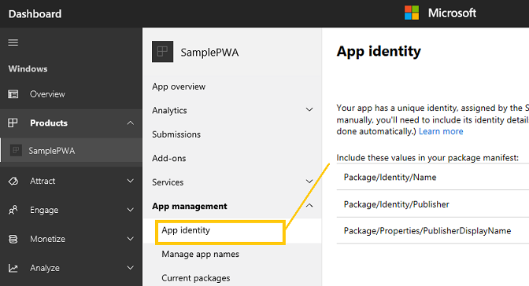

# <span data-ttu-id="c8658-104">Прогрессивное веб-приложение в Microsoft Store</span><span class="sxs-lookup"><span data-stu-id="c8658-104">Progressive Web Apps in the Microsoft Store</span></span>

<span data-ttu-id="c8658-105">При публикации прогрессивного веб-приложения (PWA) в [Microsoft Store](https://developer.microsoft.com/store)ваша потенциальная аудитория приложения расширяется до всей базы установки Windows 10, вся из почти 700 миллионов активных ежемесячных пользователей!</span><span class="sxs-lookup"><span data-stu-id="c8658-105">When you publish your Progressive Web App (PWA) to the [Microsoft Store](https://developer.microsoft.com/store), your potential app audience expands to the entire Windows 10 install base of nearly 700 million active monthly users!</span></span> 

<span data-ttu-id="c8658-106">PwAs в Microsoft Store имеет ряд преимуществ:</span><span class="sxs-lookup"><span data-stu-id="c8658-106">PWAs in the Microsoft Store enjoy a number of advantages:</span></span>

-   <span data-ttu-id="c8658-107">**Возможность обнаружения** — приложения в Microsoft Store демонстрируются в различных категориях, коллекциях и фильтрах поиска, что обеспечивает простой просмотр и покупки для потенциальных клиентов вашего приложения.</span><span class="sxs-lookup"><span data-stu-id="c8658-107">**Discoverability** - Apps in the Microsoft Store are showcased through different categories, curated collections, and search filters, providing an easy browsing and shopping experience for potential customers of your app.</span></span> <span data-ttu-id="c8658-108">Вы даже можете [улучшить описание в Магазине с](/windows/uwp/publish/app-screenshots-and-images) помощью снимков экрана, главного изображения и видео трейлеров!</span><span class="sxs-lookup"><span data-stu-id="c8658-108">You can even [enhance your Store listing](/windows/uwp/publish/app-screenshots-and-images) with screenshots, a hero image, and video trailers!</span></span>
-   <span data-ttu-id="c8658-109">**Надежность :** клиенты Windows знают, что могут доверять своим покупкам и загрузкам в Microsoft Store, так как они соблюдают строгие стандарты качества [и безопасности Корпорации Майкрософт.](/legal/windows/agreements/store-policies)</span><span class="sxs-lookup"><span data-stu-id="c8658-109">**Trustworthiness** - Windows customers know they can trust their Microsoft Store purchases and downloads because they adhere to Microsoft's rigorous [quality and safety standards](/legal/windows/agreements/store-policies).</span></span>
-   <span data-ttu-id="c8658-110">**Простая** установка — Microsoft Store обеспечивает согласованную и уместную установку во всех приложениях [для Windows 10,](https://www.microsoft.com/store/apps/windows?icid=CNavAppsWindowsApps)что позволяет всем пользователям легко установить PWA независимо от технического уровня удобства.</span><span class="sxs-lookup"><span data-stu-id="c8658-110">**Easy install** - The Microsoft Store provides a consistent and user friendly install experience across [all Windows 10 apps](https://www.microsoft.com/store/apps/windows?icid=CNavAppsWindowsApps), making it easy for all customers to install your PWA, regardless of technical comfort level.</span></span>
-   <span data-ttu-id="c8658-111">**Бизнес-аналитика.** Информационная панель Центра разработчиков [](/windows/uwp/publish/analytics) [для Windows](/windows/uwp/publish/using-the-windows-dev-center-dashboard) в Microsoft Store предоставляет подробные аналитические сведения обо всем, начиная с того, сколько клиентов Windows было достигнуто в PWA до того, как они используют его и что они должны сказать.</span><span class="sxs-lookup"><span data-stu-id="c8658-111">**Business insights** - The [Windows Dev Center dashboard](/windows/uwp/publish/using-the-windows-dev-center-dashboard) for the Microsoft Store provides you with [detailed analytics](/windows/uwp/publish/analytics) about everything from how many Windows customers your PWA has reached to how they're using it and what they have to say.</span></span> <span data-ttu-id="c8658-112">Вы также можете найти метрики и данные телеметрии о состоянии приложения, использовании и т. д.</span><span class="sxs-lookup"><span data-stu-id="c8658-112">You can also find metrics and telemetry data on app health, ad usage, and more.</span></span>
    
<span data-ttu-id="c8658-113">Существует два варианта для получения PWA в Microsoft Store:</span><span class="sxs-lookup"><span data-stu-id="c8658-113">There are two options for getting your PWA into the Microsoft Store:</span></span>

1.  <span data-ttu-id="c8658-114">Вы можете [отправить его вручную](#submitting-your-pwa-manually)или</span><span class="sxs-lookup"><span data-stu-id="c8658-114">You can [manually submit it](#submitting-your-pwa-manually), or</span></span>
2.  <span data-ttu-id="c8658-115">Если PWA соответствует [определенным критериям,](#criteria-for-automatic-submission)он может автоматически индексироваться веб-обходщиком Bing. [](#automatic-pwa-importing-with-bing)</span><span class="sxs-lookup"><span data-stu-id="c8658-115">If your PWA meets [certain criteria](#criteria-for-automatic-submission), it can be [automatically indexed](#automatic-pwa-importing-with-bing) by the Bing web crawler.</span></span> <span data-ttu-id="c8658-116">(Вы также можете [](#opting-out-of-automatic-microsoft-store-import) отказаться от автоматической отправки.)</span><span class="sxs-lookup"><span data-stu-id="c8658-116">(You also have the option to [opt-out](#opting-out-of-automatic-microsoft-store-import) of auto-submission.)</span></span>
    
<span data-ttu-id="c8658-117">Независимо от метода отправки, после присоединения PWA к Microsoft Store вы получите доступ ко всем преимуществам, описанным выше.</span><span class="sxs-lookup"><span data-stu-id="c8658-117">Regardless of submission method, once your PWA is accepted to the Microsoft Store you'll gain access to all the benefits outlined above.</span></span>

## <span data-ttu-id="c8658-118">Отправка PWA вручную</span><span class="sxs-lookup"><span data-stu-id="c8658-118">Submitting your PWA manually</span></span>

<span data-ttu-id="c8658-119">Чтобы распространять и продвигать приложение через Microsoft Store, необходимо отправить его в качестве пакета приложения для Windows *(APPX-файл).*</span><span class="sxs-lookup"><span data-stu-id="c8658-119">In order to distribute and promote an app through the Microsoft Store, you'll need to submit it as a Windows app package (*.appx* file).</span></span>  <span data-ttu-id="c8658-120">Для веб-приложений с размещенной на сервере, таких как PWAs, этот пакет просто содержит метаданные приложения и значки домашнего экрана (и ни один из фактического кода приложения).</span><span class="sxs-lookup"><span data-stu-id="c8658-120">For server-hosted web apps such as PWAs, this package simply contains app metadata and home screen icons (and none of the actual application code).</span></span> <span data-ttu-id="c8658-121">Благодаря этому ваше веб-приложение можно установить и запускать на домашнем экране вместе с другими\* \* приложениями [для Windows 10,](/windows/uwp/get-started/whats-a-uwp) завернув облегченной программы-оболочки (WWAHost.exe), независимо от окна браузера Microsoft Edge.</span><span class="sxs-lookup"><span data-stu-id="c8658-121">With this, your web app can be installed and launched from the home screen alongside other [Windows 10 apps](/windows/uwp/get-started/whats-a-uwp) by running in a lightweight native app wrapper (*WWAHost.exe* process), independent from the Microsoft Edge browser window.</span></span>  

> [!IMPORTANT]
> <span data-ttu-id="c8658-122">Обдвижок веб-платформы EdgeHTML используется оболочкой приложения WWAHost, что может привести к различиям в совместимости для PWA на основе Microsoft Edge (Chromium).</span><span class="sxs-lookup"><span data-stu-id="c8658-122">The EdgeHTML web platform engine is used by the WWAHost app wrapper which could introduce compatibility differences for your Microsoft Edge (Chromium) based PWA.</span></span>  <span data-ttu-id="c8658-123">Перед отправкой приложения в Microsoft Store убедитесь, что приложение прошло полный тестовый проход с помощью Microsoft Edge (EdgeHTML), так как обдвижка EdgeHTML больше не обновляется новыми веб-стандартами.</span><span class="sxs-lookup"><span data-stu-id="c8658-123">Be sure to do a full test pass on your application using Microsoft Edge (EdgeHTML) before submitting your app to the Microsoft store as the EdgeHTML engine is no longer being updated with newer web standards.</span></span>  

<span data-ttu-id="c8658-124">Вот как это сделать.</span><span class="sxs-lookup"><span data-stu-id="c8658-124">Here's how to do it.</span></span>

### <span data-ttu-id="c8658-125">Предварительные условия</span><span class="sxs-lookup"><span data-stu-id="c8658-125">Prerequisites</span></span>

-   <span data-ttu-id="c8658-126">**Существующий PWA.**</span><span class="sxs-lookup"><span data-stu-id="c8658-126">**An existing PWA**.</span></span> <span data-ttu-id="c8658-127">Вот как преобразовать [веб-приложение в PWA,](./get-started.md) если оно еще не является веб-приложением.</span><span class="sxs-lookup"><span data-stu-id="c8658-127">Here's how to [convert your web app to a PWA](./get-started.md) if it isn't one already.</span></span> 
-   <span data-ttu-id="c8658-128">**Средство упаковки Windows APPX для PWAs.**</span><span class="sxs-lookup"><span data-stu-id="c8658-128">**A Windows APPX packaging tool for PWAs**.</span></span> <span data-ttu-id="c8658-129">Вот как создать и запустить [PWA в Windows](./windows-features.md) с помощью Visual Studio.</span><span class="sxs-lookup"><span data-stu-id="c8658-129">Here's how to [build and run your PWA on Windows](./windows-features.md) using Visual Studio.</span></span> <span data-ttu-id="c8658-130">Вы также можете использовать [построитель PWA](https://www.pwabuilder.com/) для создания пакета Windows.</span><span class="sxs-lookup"><span data-stu-id="c8658-130">You can also use [PWA Builder](https://www.pwabuilder.com/) to build a Windows package.</span></span>
-   <span data-ttu-id="c8658-131">[**Учетная запись разработчика приложений Microsoft Store.**](/windows/uwp/publish/opening-a-developer-account)</span><span class="sxs-lookup"><span data-stu-id="c8658-131">[**Microsoft Store app developer account**](/windows/uwp/publish/opening-a-developer-account).</span></span> <span data-ttu-id="c8658-132">В зависимости [от](/windows/uwp/publish/account-types-locations-and-fees) типа и расположения выбранной учетной записи взимается разовая плата, а для регистрации требуется действующая [учетная запись Майкрософт.](https://account.microsoft.com/)</span><span class="sxs-lookup"><span data-stu-id="c8658-132">There is a [one-time fee](/windows/uwp/publish/account-types-locations-and-fees) depending on your chosen account type and location, and registration requires a valid [Microsoft Account](https://account.microsoft.com/).</span></span>
    
### <span data-ttu-id="c8658-133">Отправка в Магазин *через Visual Studio*</span><span class="sxs-lookup"><span data-stu-id="c8658-133">Store submission through *Visual Studio*</span></span> 

<span data-ttu-id="c8658-134">Выполните следующие [действия, чтобы создать файл](/windows/uwp/packaging/packaging-uwp-apps#create-an-app-package-upload-file) отправки пакета приложения для PWA в Visual Studio.</span><span class="sxs-lookup"><span data-stu-id="c8658-134">Follow these steps to [create an app package upload file](/windows/uwp/packaging/packaging-uwp-apps#create-an-app-package-upload-file) for your PWA in Visual Studio.</span></span> <span data-ttu-id="c8658-135">Более общие сведения об этом процессе см. в Visual Studio package a [*UWP*](/windows/uwp/packaging/packaging-uwp-apps) app with Visual Studio.</span><span class="sxs-lookup"><span data-stu-id="c8658-135">See [*Package a UWP app with Visual Studio*](/windows/uwp/packaging/packaging-uwp-apps) for a more general overview of this process.</span></span>

<span data-ttu-id="c8658-136">Эти инструкции также повысят запуск комплекта сертификации приложений [**для Windows,**](https://developer.microsoft.com/windows/develop/app-certification-kit) чтобы протестировать приложение на соответствие требованиям Microsoft Store.</span><span class="sxs-lookup"><span data-stu-id="c8658-136">The instructions will also guide you through running the [**Windows App Certification Kit**](https://developer.microsoft.com/windows/develop/app-certification-kit) to test your app for compliance with Microsoft Store requirements.</span></span> <span data-ttu-id="c8658-137">Это необязательный, но настоятельно рекомендуемый вариант.</span><span class="sxs-lookup"><span data-stu-id="c8658-137">This is optional, but highly recommended.</span></span>

### <span data-ttu-id="c8658-138">Отправка в Магазин через *Центр разработчиков для Windows*</span><span class="sxs-lookup"><span data-stu-id="c8658-138">Store submission through *Windows Dev Center*</span></span>

<span data-ttu-id="c8658-139">Ниже построитель *PWA* используется для создания пакета приложения для отправки в Центр разработчиков для Windows.</span><span class="sxs-lookup"><span data-stu-id="c8658-139">Here's how to use *PWA Builder* to generate an app package for upload to the Windows Dev Center.</span></span>

1.  <span data-ttu-id="c8658-140">Создание приложения для Windows 10.</span><span class="sxs-lookup"><span data-stu-id="c8658-140">Generate your Windows 10 app.</span></span> <span data-ttu-id="c8658-141">Вот как запустить [PWA](./windows-features.md)в качестве приложения для Windows с Visual Studio.</span><span class="sxs-lookup"><span data-stu-id="c8658-141">Here's how to run your [PWA as a Windows app with Visual Studio](./windows-features.md).</span></span> <span data-ttu-id="c8658-142">Вы также можете использовать [построитель PWA](https://www.pwabuilder.com/) для создания приложения для Windows 10.</span><span class="sxs-lookup"><span data-stu-id="c8658-142">You can also use [PWA Builder](https://www.pwabuilder.com/) to generate your Windows 10 app.</span></span>
2.  <span data-ttu-id="c8658-143">Зарезервировать имя приложения для Microsoft Store, войдя в информационную панель Центра разработчиков [для Windows](https://developer.microsoft.com/dashboard/windows/overview) с информацией об учетной записи и выйдя на его создание, зарезервировать [имя.](/windows/uwp/publish/create-your-app-by-reserving-a-name)</span><span class="sxs-lookup"><span data-stu-id="c8658-143">Reserve your app name for the Microsoft Store by logging into the [Windows Dev Center dashboard](https://developer.microsoft.com/dashboard/windows/overview) with your account info and following the steps to [create your app by reserving a name](/windows/uwp/publish/create-your-app-by-reserving-a-name).</span></span> <span data-ttu-id="c8658-144">Каждое зарезервированное имя должно быть уникальным в Microsoft Store.</span><span class="sxs-lookup"><span data-stu-id="c8658-144">Each reserved name must be unique throughout the Microsoft Store.</span></span>
3.  <span data-ttu-id="c8658-145">При отправке пакетов приложения значения *DisplayName,* *Name,* *Publisher*и *PublisherDisplayName* в файле *.appxmanifest* должны совпадать со значениями, присвоенным приложению на информационной панели Центра разработчиков для Windows после его засчета.</span><span class="sxs-lookup"><span data-stu-id="c8658-145">When you upload your app's packages, the *DisplayName*, *Name*, *Publisher*, and *PublisherDisplayName* values in your *.appxmanifest* file must match the values assigned to your app in the Windows Dev Center dashboard upon reserving its name.</span></span> 
    
    <span data-ttu-id="c8658-146">Войдите на информационную [панель Центра разработчиков для Windows](https://developer.microsoft.com/dashboard/windows/overview)и найдите значения удостоверения приложения в **удостоверении**приложения управления  >  **приложениями:**</span><span class="sxs-lookup"><span data-stu-id="c8658-146">Log into the [Windows Dev Center dashboard](https://developer.microsoft.com/dashboard/windows/overview), and locate your app identity values under **App management** > **App identity**:</span></span>
    
    
    
    <span data-ttu-id="c8658-148">Затем найдите файл и замените следующие значения на те, которые назначены на информационной панели `appxmanifest.xml` Центра разработчиков для Windows:</span><span class="sxs-lookup"><span data-stu-id="c8658-148">Then, locate your `appxmanifest.xml` file and replace the following values with the ones assigned in the Windows Dev Center dashboard:</span></span>
    
    -   <span data-ttu-id="c8658-149">**<Identity Name="** *Package/Identity/Name*</span><span class="sxs-lookup"><span data-stu-id="c8658-149">**<Identity Name="** *Package/Identity/Name*</span></span>
    -   <span data-ttu-id="c8658-150">**<Identity Publisher="** *Package/Identity/Publisher*</span><span class="sxs-lookup"><span data-stu-id="c8658-150">**<Identity Publisher="** *Package/Identity/Publisher*</span></span>
    -   <span data-ttu-id="c8658-151">**<DisplayName** **>** *Имя, зарезервированное для вашего приложения*</span><span class="sxs-lookup"><span data-stu-id="c8658-151">**<DisplayName** **>** *Name you reserved for your app*</span></span> 
    -   <span data-ttu-id="c8658-152">**<PublisherDisplayName** **>** *Package/Properties/PublisherDisplayName\*\*\*</PublisherDisplayName>*\*</span><span class="sxs-lookup"><span data-stu-id="c8658-152">**<PublisherDisplayName** **>** *Package/Properties/PublisherDisplayName* **</PublisherDisplayName>**</span></span>
        
4.  <span data-ttu-id="c8658-153">Теперь все ресурсы PWA можно скомпилировать в один файл, который можно `.appx` отправить в Microsoft Store.</span><span class="sxs-lookup"><span data-stu-id="c8658-153">Now you're ready to compile all your PWA resources into a single `.appx` file you can upload to the Microsoft Store.</span></span> <span data-ttu-id="c8658-154">В командной подсказке перейдите в каталог веб-манифеста и создайте пакет Windows 10 (указанный ниже, если вы не можете вести журнал отлаживки).</span><span class="sxs-lookup"><span data-stu-id="c8658-154">From a command prompt, navigate to the directory of your web manifest and create a Windows 10 package (specified below w/ optional debug logging):</span></span>
    
    ```shell
    pwabuilder package -p windows10 -l debug
    ```  
    
    <span data-ttu-id="c8658-155">AppX-файл будет создан в этом расположении: `PWA\Store packages\windows10\package\windows.appx` .</span><span class="sxs-lookup"><span data-stu-id="c8658-155">Your .appx file will be generated to this location: `PWA\Store packages\windows10\package\windows.appx`.</span></span>
    
5.  <span data-ttu-id="c8658-156">Перед отправкой приложения в Microsoft Store для подчиненного ему стоит проверить его на соответствие политикам Microsoft Store.</span><span class="sxs-lookup"><span data-stu-id="c8658-156">Before you upload your app for submisison to the Microsoft Store, its a good idea to test your app for compliance with Microsoft Store policies.</span></span> <span data-ttu-id="c8658-157">Это можно сделать, скачав комплект сертификации приложений [**для Windows,**](https://developer.microsoft.com/windows/develop/app-certification-kit)запустив его, а затем выбрав *APPX-файл* приложения для тестирования.</span><span class="sxs-lookup"><span data-stu-id="c8658-157">You can do this by downloading the [**Windows App Certification Kit**](https://developer.microsoft.com/windows/develop/app-certification-kit), launching it, and then selecting your app's *.appx* file for testing.</span></span> <span data-ttu-id="c8658-158">После завершения всех тестов вы получите отчет о областях, которые необходимо решить.</span><span class="sxs-lookup"><span data-stu-id="c8658-158">You will receive a report of areas to address once all the tests are complete.</span></span>
6.  <span data-ttu-id="c8658-159">Загрузите пакет и завершите отправку, снова войдя в \*\*\*\* информационную панель Центра разработчиков [для Windows](https://developer.microsoft.com/dashboard/windows/overview) и расширив панель "Подмывка  >  **отправки 1".**</span><span class="sxs-lookup"><span data-stu-id="c8658-159">Upload your package and complete the submission by logging back into the [Windows Dev Center dashboard](https://developer.microsoft.com/dashboard/windows/overview) and expanding the **Submissions** > **Submisison 1** panel.</span></span> <span data-ttu-id="c8658-160">Следуйте контрольным спискам, чтобы заполнить [необходимые](/windows/uwp/publish/app-submissions) сведения о списке в магазине [и отправить пакет приложения.](/windows/uwp/publish/upload-app-packages)</span><span class="sxs-lookup"><span data-stu-id="c8658-160">Follow the checklist to complete the [required store listing information](/windows/uwp/publish/app-submissions) and [upload your app package](/windows/uwp/publish/upload-app-packages).</span></span>
    
<span data-ttu-id="c8658-161">Подробнее о всех доступных разработчикам приложений Microsoft Store функций и служб см. в публикации приложений [*для Windows*](https://developer.microsoft.com/store/publish-apps) в [Центре разработки для Windows.](https://developer.microsoft.com/windows)</span><span class="sxs-lookup"><span data-stu-id="c8658-161">For more on the all the features and services available to Microsoft Store app developers, see [*Publish Windows apps*](https://developer.microsoft.com/store/publish-apps) on the [Windows Dev Center](https://developer.microsoft.com/windows).</span></span>

## <span data-ttu-id="c8658-162">Автоматический импорт PWA с помощью Bing</span><span class="sxs-lookup"><span data-stu-id="c8658-162">Automatic PWA importing with Bing</span></span>

<span data-ttu-id="c8658-163">Так же как манифест [](https://developer.mozilla.org/docs/Web/Manifest) веб-приложения PWA является сигналом для поддержки платформ, что ваше приложение может работать в автономном режиме и готово к тому, чтобы его можно было представить как полностью интегрированное приложение, это также является подсказкой для веб-обходщика Bing о том, что PWA следует рассматривать для автоматического включения в Microsoft Store.</span><span class="sxs-lookup"><span data-stu-id="c8658-163">Just as your PWA's [web app manifest](https://developer.mozilla.org/docs/Web/Manifest) is a signal to supporting platforms that your app is offline-capable and ready to be presented as a fully integrated app experience, it's also a hint to the Bing web crawler that your PWA should be considered for automatic inclusion in the Microsoft Store.</span></span> 

<span data-ttu-id="c8658-164">Если PWA соответствует требованиям ниже, служба индексации Bing автоматически упаковит PWA в формат [*APPX,*](#submitting-your-pwa-manually) необходимый для установки в Windows 10, и соберет страницу продукта магазина вашего приложения на основе метаданных в манифесте веб-приложения.</span><span class="sxs-lookup"><span data-stu-id="c8658-164">If your PWA meets the requirements below, the Bing indexing service will automatically package your PWA in the [*.appx*](#submitting-your-pwa-manually) format required for installation on Windows 10 and assemble your app's store product page based on the metadata in its web app manifest.</span></span> <span data-ttu-id="c8658-165">После утверждения PWA вы сможете дополнительно настроить страницу Магазина и получить доступ к аналитике пользователей и другим средствам управления приложениями через информационную панель Центра разработчиков для Windows.</span><span class="sxs-lookup"><span data-stu-id="c8658-165">After claiming your PWA, you'll be able to further customize your store page and gain access to user analytics and other app management tools through the Windows Dev Center dashboard.</span></span>

### <span data-ttu-id="c8658-166">Критерии автоматической отправки</span><span class="sxs-lookup"><span data-stu-id="c8658-166">Criteria for automatic submission</span></span>

<span data-ttu-id="c8658-167">Для автоматической упаковки и перечисления в Microsoft Store вашему PWA потребуется:</span><span class="sxs-lookup"><span data-stu-id="c8658-167">To be automatically packaged and listed for the Microsoft Store, your PWA will need:</span></span>

-   <span data-ttu-id="c8658-168">Непустый файл манифеста веб-приложения, как минимум:</span><span class="sxs-lookup"><span data-stu-id="c8658-168">A non-empty web app manifest file, with at minimum:</span></span>
    
    -   <span data-ttu-id="c8658-169">Имя</span><span class="sxs-lookup"><span data-stu-id="c8658-169">Name</span></span>
    -   <span data-ttu-id="c8658-170">Описание</span><span class="sxs-lookup"><span data-stu-id="c8658-170">Description</span></span>
    -   <span data-ttu-id="c8658-171">Значок приложения размером не менее 512 x 512 пикселей</span><span class="sxs-lookup"><span data-stu-id="c8658-171">App icon that is at least 512 x 512 pixels</span></span>
        
-   <span data-ttu-id="c8658-172">Уникальная основная логика (не минимально измененный код из шаблона [приложения)](https://en.wikipedia.org/wiki/Boilerplate_code)</span><span class="sxs-lookup"><span data-stu-id="c8658-172">Unique core logic (not minimally modified code from an [app boilerplate](https://en.wikipedia.org/wiki/Boilerplate_code) template)</span></span>
-   <span data-ttu-id="c8658-173">Для безопасного подключения (HTTPS)</span><span class="sxs-lookup"><span data-stu-id="c8658-173">To be served over a secure connection (HTTPS)</span></span>
-   <span data-ttu-id="c8658-174">Скрипты рабочих служб</span><span class="sxs-lookup"><span data-stu-id="c8658-174">Service worker script(s)</span></span>
-   <span data-ttu-id="c8658-175">Чтобы не нарушать законы или политики [Microsoft Store.](/legal/windows/agreements/store-policies)</span><span class="sxs-lookup"><span data-stu-id="c8658-175">To not violate any laws or [Microsoft Store policies](/legal/windows/agreements/store-policies).</span></span>
    
<span data-ttu-id="c8658-176">Мы не будем использовать все приложения, удовлетворяющие этим критериям, но включим их в свои вопросы для кандидатов по мере постепенного расширения нашей программы.</span><span class="sxs-lookup"><span data-stu-id="c8658-176">We won't ingest every app that meets these criteria, but will be including them in our considerations for candidates as we gradually expand our program.</span></span>

### <span data-ttu-id="c8658-177">Отказ от автоматического импорта в Microsoft Store</span><span class="sxs-lookup"><span data-stu-id="c8658-177">Opting out of automatic Microsoft Store import</span></span>

<span data-ttu-id="c8658-178">PWA может отказаться от автоматического импорта в Microsoft Store, обслуживая файл, содержащий `robots.txt` следующие данные:</span><span class="sxs-lookup"><span data-stu-id="c8658-178">Your PWA can opt out of automatic import to the Microsoft Store by serving a `robots.txt` file containing the following:</span></span>

```text
User-agent: bingbot
Disallow: /manifest.json
```  

<span data-ttu-id="c8658-179">Это направляет веб-обходщик Bing (Bingbot) игнорировать файл веб-манифеста в целях индексации PWA.</span><span class="sxs-lookup"><span data-stu-id="c8658-179">This directs the Bing web crawler (Bingbot) to disregard your web manifest file for PWA indexing purposes.</span></span> <span data-ttu-id="c8658-180">Это не повлияет на ранжирование поиска сайта в обычном процессе веб-индексирования [Bing.](https://www.bing.com/webmaster/help/help-center-661b2d18)</span><span class="sxs-lookup"><span data-stu-id="c8658-180">This will not affect your site's search ranking in Bing's regular [web indexing process](https://www.bing.com/webmaster/help/help-center-661b2d18).</span></span>
