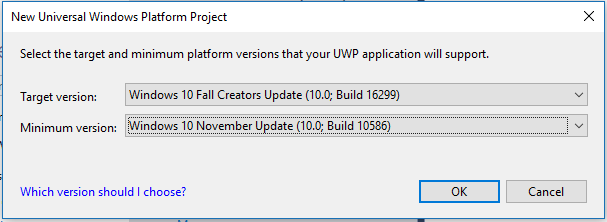

# <span data-ttu-id="654ee-104">Подгоняйте PWA (EdgeHTML) для Windows</span><span class="sxs-lookup"><span data-stu-id="654ee-104">Tailor your PWA (EdgeHTML) for Windows</span></span>  

<span data-ttu-id="654ee-105">PwAs, установленные в [][PwaIndexWindows10] Windows 10, пользуются всеми преимуществами работы в качестве приложений универсальной платформы [Windows \(UWP\),][WindowsUWPGetStartedGuide] включая защиту с помощью безопасности песочниц приложений для Windows и полный доступ к API среды запуска [Windows (WinRT\)),][UwpApiIndex] включая API для:</span><span class="sxs-lookup"><span data-stu-id="654ee-105">PWAs installed on Windows 10 enjoy [all the benefits][PwaIndexWindows10] of running as [Universal Windows Platform \(UWP\)][WindowsUWPGetStartedGuide] apps, including protection through Windows app sandboxing security and full access to [Windows Runtime \(WinRT\))][UwpApiIndex] APIs, including those for:</span></span>  

*   <span data-ttu-id="654ee-106">Управление функциями устройства \(например, камерой, микрофоном, GPS\)</span><span class="sxs-lookup"><span data-stu-id="654ee-106">Controlling device features \(such as camera, microphone, GPS\)</span></span>  
*   <span data-ttu-id="654ee-107">Доступ к пользовательским ресурсам \(например, календарю, контактам, документам, музыке\)</span><span class="sxs-lookup"><span data-stu-id="654ee-107">Accessing user resources \(such as calendar, contacts, documents, music\)</span></span>  
*   <span data-ttu-id="654ee-108">Запуск и навигация по приложению с помощью голосовых команд Кортаны</span><span class="sxs-lookup"><span data-stu-id="654ee-108">Launching / navigating your app through Cortana voice commands</span></span>  
*   <span data-ttu-id="654ee-109">Интеграция с ос Windows \(через Центр действий Windows, панель задач рабочего стола и контекстные меню\)</span><span class="sxs-lookup"><span data-stu-id="654ee-109">Integrating with the Windows OS \(through the Windows Action Center, desktop taskbar, and context menus\)</span></span>  
    
<span data-ttu-id="654ee-110">Это лишь некоторые из добавленных возможностей для PWA \(EdgeHTML\) в Windows.</span><span class="sxs-lookup"><span data-stu-id="654ee-110">These are only a few of the added possibilities for your PWA \(EdgeHTML\) on Windows.</span></span>  

<span data-ttu-id="654ee-111">В этой статье показано, как установить, запустить и улучшить PWA \(EdgeHTML\) как приложение для Windows 10, обеспечивая совместимость между браузерами и кроссплатформенами.</span><span class="sxs-lookup"><span data-stu-id="654ee-111">This article shows you how to install, run, and enhance your PWA \(EdgeHTML\) as a Windows 10 app, while still ensuring cross-browser and cross-platform compatibility.</span></span>  

> [!IMPORTANT]
> <span data-ttu-id="654ee-112">Примеры и действия в этой статье требуют Visual Studio 2017.</span><span class="sxs-lookup"><span data-stu-id="654ee-112">The examples and steps in this article require Visual Studio 2017.</span></span> <span data-ttu-id="654ee-113">Visual Studio 2019 не включает шаблон, используемый в этой статье.</span><span class="sxs-lookup"><span data-stu-id="654ee-113">Visual Studio 2019 does not include the template used in this article.</span></span> <span data-ttu-id="654ee-114">Чтобы скачать Visual Studio 2017, см. Visual Studio [Downloads - 2017, 2015 & Previous Versions][PreviousVSDownloads]</span><span class="sxs-lookup"><span data-stu-id="654ee-114">To download Visual Studio 2017, see [Visual Studio Downloads - 2017, 2015 & Previous Versions][PreviousVSDownloads]</span></span>  


## <span data-ttu-id="654ee-115">Предварительные условия</span><span class="sxs-lookup"><span data-stu-id="654ee-115">Prerequisites</span></span>  

*   <span data-ttu-id="654ee-116">Существующий веб-клиент PWA (или веб-приложение для узла\), сайт live или localhost.</span><span class="sxs-lookup"><span data-stu-id="654ee-116">An existing PWA \(or hosted web app\), either a live or localhost site.</span></span>  <span data-ttu-id="654ee-117">В этом руководстве используется пример PWA из ["Начало работы с "Прогрессивной веб-приложениями".][PwaGetStarted]</span><span class="sxs-lookup"><span data-stu-id="654ee-117">This guide uses the sample PWA from [Get started with Progressive Web Apps][PwaGetStarted].</span></span>  
*   <span data-ttu-id="654ee-118">Скачайте файл \(free\) [Visual Studio Community 2017.][MicrosoftVisualStudio|::ref1::|]</span><span class="sxs-lookup"><span data-stu-id="654ee-118">Download the \(free\) [Visual Studio Community 2017][MicrosoftVisualStudio|::ref1::|].</span></span>  <span data-ttu-id="654ee-119">Вы также можете использовать выпуски Professional, Enterprise или [Preview.][MicrosoftVisualStudioPreview]</span><span class="sxs-lookup"><span data-stu-id="654ee-119">You are also able to use the Professional, Enterprise, or [Preview][MicrosoftVisualStudioPreview] editions.</span></span>  <span data-ttu-id="654ee-120">В установщике Visual Studio выберите следующие рабочие нагрузки:</span><span class="sxs-lookup"><span data-stu-id="654ee-120">From the Visual Studio Installer, choose the following Workloads:</span></span>  
    *   **<span data-ttu-id="654ee-121">Разработка универсальной платформы Windows</span><span class="sxs-lookup"><span data-stu-id="654ee-121">Universal Windows Platform development</span></span>**  
        
## <span data-ttu-id="654ee-122">Настройка и запуск универсального приложения для Windows</span><span class="sxs-lookup"><span data-stu-id="654ee-122">Set up and run your Universal Windows app</span></span>  

<span data-ttu-id="654ee-123">PWA \(EdgeHTML\), установленный как приложение для Windows 10, запускается независимо от браузера в отдельном окне \( `WWAHost.exe` процесс\).</span><span class="sxs-lookup"><span data-stu-id="654ee-123">A PWA \(EdgeHTML\) installed as a Windows 10 app runs independently from the browser, in a standalone \(`WWAHost.exe` process\) window.</span></span>  <span data-ttu-id="654ee-124">Для этого просто требуется облегченная оболочка приложения, содержащая размещенную веб-приложение, которую можно быстро настроить с помощью шаблона Visual Studio `Progressive Web App (Universal Windows)` проекта.</span><span class="sxs-lookup"><span data-stu-id="654ee-124">Enabling this simply requires a lightweight app wrapper that contains your hosted web app, which you are able to quickly set up using the Visual Studio `Progressive Web App (Universal Windows)` project template.</span></span>  <span data-ttu-id="654ee-125">\(Вся логика приложения, включая отправку исходных запросов API времени работы Windows, по-прежнему происходит в исходном коде веб-приложения.\)</span><span class="sxs-lookup"><span data-stu-id="654ee-125">\(All your app logic, including sending native Windows Runtime API requests, still happens in your original web app code.\)</span></span>  

<span data-ttu-id="654ee-126">Настройка среды разработки приложений для Windows в Visual Studio.</span><span class="sxs-lookup"><span data-stu-id="654ee-126">Set up your Windows app development environment in Visual Studio.</span></span>  

1.  <span data-ttu-id="654ee-127">В параметрах Windows включите [режим разработчика.][WindowsUWPGetStartedEnable]</span><span class="sxs-lookup"><span data-stu-id="654ee-127">In your Windows Settings, turn on [Developer mode][WindowsUWPGetStartedEnable].</span></span>  <span data-ttu-id="654ee-128">\(Введите `developer mode` на панели поиска Windows, чтобы найти его.\)</span><span class="sxs-lookup"><span data-stu-id="654ee-128">\(Type `developer mode` in the Windows searchbar to find it.\)</span></span>  
1.  <span data-ttu-id="654ee-129">Запустите Visual Studio и выберите **"Создать новый проект"...**</span><span class="sxs-lookup"><span data-stu-id="654ee-129">Launch Visual Studio and select **Create a new project...**.</span></span>  
1.  <span data-ttu-id="654ee-130">Выберите **универсальный javascript**для Windows и выберите  >  \*\*\*\* **"Прогрессивное веб-приложение (универсальные** приложения для Windows) в списке типов проектов Visual Studio 2017.</span><span class="sxs-lookup"><span data-stu-id="654ee-130">Choose **Javascript** > **Windows Universal** and select **Progressive Web App (Universal Windows)** from the list of project types in Visual Studio 2017.</span></span>  
1.  <span data-ttu-id="654ee-131">Выберите Windows 10 по умолчанию `Target version` \(самый последний выпуск\) и `Minimum version` \(сборка 10586 или выше\) и выберите **"ОК".**</span><span class="sxs-lookup"><span data-stu-id="654ee-131">Select the default Windows 10 `Target version` \(most recent release\) and `Minimum version` \(build 10586 or higher\) and choose **OK**.</span></span>  
    
      
    
    <span data-ttu-id="654ee-133">Новый проект загружается с открытым конструктором package.appxmanifest.</span><span class="sxs-lookup"><span data-stu-id="654ee-133">Your new project loads with the package.appxmanifest designer open.</span></span>  <span data-ttu-id="654ee-134">Здесь вы настраиваете сведения о приложении, включая удостоверение пакета, зависимости пакета, необходимые возможности, визуальные элементы и точки возможности.</span><span class="sxs-lookup"><span data-stu-id="654ee-134">This is where you configure the details of your app, including package identity, package dependencies, required capabilities, visual elements, and extensibility points.</span></span>  <span data-ttu-id="654ee-135">Это легко настраиваемая временная версия манифеста пакета приложения, используемая во время разработки приложения.</span><span class="sxs-lookup"><span data-stu-id="654ee-135">This is an easily configurable, temporary version of the app package manifest used during app development.</span></span>  
    <span data-ttu-id="654ee-136">При создании проекта приложения [][UwpSchemasAppxpackageUapmanifestschemaGeneratePackageManifest] Visual Studio создает AppxManifest.xmlиз этих метаданных, который используется для установки и запуска приложения.</span><span class="sxs-lookup"><span data-stu-id="654ee-136">When you build your app project, [Visual Studio generates an AppxManifest.xml][UwpSchemasAppxpackageUapmanifestschemaGeneratePackageManifest] file from this metadata, which is used to install and run your app.</span></span>  <span data-ttu-id="654ee-137">Каждый раз при обновлении файла обязательно перестраивать проект, чтобы оба они были отражены в `package.appxmanifest` вашей `AppxManifest.xml` времени работы.</span><span class="sxs-lookup"><span data-stu-id="654ee-137">Whenever you update your `package.appxmanifest` file, be sure to rebuild the project so both are reflected in your `AppxManifest.xml` at runtime.</span></span>  
    
1.  <span data-ttu-id="654ee-138">В панели приложения конструктора **манифестов** введите URL-адрес PWA в качестве `Start page` .</span><span class="sxs-lookup"><span data-stu-id="654ee-138">In the manifest designer **Application** panel, enter the URL of your PWA as the `Start page`.</span></span>
    
    > [!NOTE]
    > <span data-ttu-id="654ee-139">Службы поддерживаются для всех URL-адресов https \(secure, remote\), указанных как `StartPage` .</span><span class="sxs-lookup"><span data-stu-id="654ee-139">Service workers are supported for all https \(secure, remote\) urls specified as the `StartPage`.</span></span>  <span data-ttu-id="654ee-140">Рабочие службы не поддерживаются по умолчанию для веб-приложений, которые указывают локализованную начните страницу.</span><span class="sxs-lookup"><span data-stu-id="654ee-140">Service workers are not supported by default for web apps that specify a local start page.</span></span>  <span data-ttu-id="654ee-141">Чтобы включить поддержку рабочих служб в этих случаях, добавьте в манифест явную запись [ApplicationContentUriRules,](#set-application-content-uri-rules-acurs) например:</span><span class="sxs-lookup"><span data-stu-id="654ee-141">To enable service worker support for these cases, add an explicit [ApplicationContentUriRules](#set-application-content-uri-rules-acurs) entry to the manifest, for example:</span></span> `<uap:Rule Match="http://web-platform.test/" Type="include" uap5:ServiceWorker="true"/>`  
    
      
    
    <span data-ttu-id="654ee-143">Вы также можете изменять параметры и изменять `Display name` их `Description` так, как хотите.</span><span class="sxs-lookup"><span data-stu-id="654ee-143">You are able to also modify the `Display name` and `Description` as you like.</span></span>  
1.  <span data-ttu-id="654ee-144">Сохраните этот файл \(или другое изображение размером 512x512 по вашему выбору) на рабочий стол.</span><span class="sxs-lookup"><span data-stu-id="654ee-144">Save this file \(or another 512x512 image of your choosing\) to your desktop.</span></span>  
    <span data-ttu-id="654ee-145">Затем в панели \*\*\*\* визуальных активов конструктора манифестов нажмите кнопку "Поле...", выберите его в качестве источника и нажмите `Source` кнопку **"Создать".** \*\*\*\*</span><span class="sxs-lookup"><span data-stu-id="654ee-145">Then, in the manifest designer **Visual Assets** panel, click on the `Source` field **...** button, select it as your source file, and click **Generate**.</span></span>  <span data-ttu-id="654ee-146">\(Затем нажмите **кнопку "ОК",** чтобы переписать изображения-замещитель по умолчанию\).</span><span class="sxs-lookup"><span data-stu-id="654ee-146">\(Then click **OK** to overwrite the default placeholder images\).</span></span>  
    
      
    
    <span data-ttu-id="654ee-148">Это создает основные визуальные ресурсы для установки, запуска, запуска и распространения приложения в Магазине.</span><span class="sxs-lookup"><span data-stu-id="654ee-148">This generates the basic visual assets for installing, running, launching, and distributing your app in the store.</span></span>  
    <span data-ttu-id="654ee-149">Если вы видите какие-либо красные \( \) ошибки, указывающие отсутствующие изображения, вы можете нажать кнопки ..., чтобы вручную выбрать файл из `X` созданных изображений. \*\*\*\*</span><span class="sxs-lookup"><span data-stu-id="654ee-149">If you see any red \(`X`\) errors indicating missing images, you are able to click on the **...** buttons to manually select a file from the generated images.</span></span>  
1.  <span data-ttu-id="654ee-150">В панели **ОКРИС** контента конструктора манифеста замените расположение `http://example.com` PWA `Rule`  =  `include` (например, `WinRT Access`  =  `All` "\").</span><span class="sxs-lookup"><span data-stu-id="654ee-150">In the manifest designer **Content URIs** panel, replace `http://example.com` with the location of your PWA \(such that `Rule` = `include` and `WinRT Access` = `All`\).</span></span>  
    <span data-ttu-id="654ee-151">Это дает вашему PWA разрешение на отправку собственный API-запросов windows \(WinRT\) при запуске в качестве приложения для Windows 10, которое будет охвачено немного позже.</span><span class="sxs-lookup"><span data-stu-id="654ee-151">This grants your PWA permission to send native Windows Runtime \(WinRT\) API requests when running as a Windows 10 app, which is covered a bit later.</span></span>   <span data-ttu-id="654ee-152">Если вашему PWA не требуется доступ WinRT, вы можете переключить значение на `WinRT Access` `None` .</span><span class="sxs-lookup"><span data-stu-id="654ee-152">If your actual PWA does not require WinRT access, you are able to switch the `WinRT Access` value to `None`.</span></span>  <span data-ttu-id="654ee-153">В любом случае не забудьте угрузить строку по умолчанию с помощью URI PWA, иначе приложение не сможет должным образом загрузиться `http://example.com` во время работы.</span><span class="sxs-lookup"><span data-stu-id="654ee-153">Either way, be sure to sub out the default `http://example.com` string with the URI of your PWA, or your app is not able to properly load at runtime.</span></span>  
    <span data-ttu-id="654ee-154">Вы готовы запустить и отладить PWA в качестве приложения для Windows 10.</span><span class="sxs-lookup"><span data-stu-id="654ee-154">You are ready to run and debug your PWA as a Windows 10 app.</span></span>  <span data-ttu-id="654ee-155">Если вы используете сайт localhost для пошаговой работы с этим руководством, убедитесь, что он запущен.</span><span class="sxs-lookup"><span data-stu-id="654ee-155">If you are using a localhost site to step through this guide, make sure it is running.</span></span>  <span data-ttu-id="654ee-156">Затем,</span><span class="sxs-lookup"><span data-stu-id="654ee-156">Then,</span></span>  
1.  <span data-ttu-id="654ee-157">Сборка \( `Ctrl` + `Shift` + `F5` \) и запуск \( `F5` \) проекта PWA.</span><span class="sxs-lookup"><span data-stu-id="654ee-157">Build \(`Ctrl`+`Shift`+`F5`\) and Run \(`F5`\) your PWA project.</span></span>  <span data-ttu-id="654ee-158">Теперь веб-сайт должен запускаться в окне автономных приложений.</span><span class="sxs-lookup"><span data-stu-id="654ee-158">Your website should now launch in a standalone app window.</span></span>  <span data-ttu-id="654ee-159">Это не только веб-приложение, которое находится в окнах; он работает как прогрессивное веб-приложение, установленное в Windows 10!</span><span class="sxs-lookup"><span data-stu-id="654ee-159">Not only is it a hosted web app; it is running as a Progressive Web App installed on Windows 10!</span></span>  
    
      
    
## <span data-ttu-id="654ee-161">Отлагивание PWA \(EdgeHTML\) в качестве приложения для Windows</span><span class="sxs-lookup"><span data-stu-id="654ee-161">Debug your PWA \(EdgeHTML\) as a Windows app</span></span>  

<span data-ttu-id="654ee-162">Так как PWA \(EdgeHTML\) — это просто постепенно улучшенное веб-приложение с расширенными службами, вы можете отлагоерировать серверный код так же, как и любое веб-приложение, используя обычную IDE и рабочий процесс.</span><span class="sxs-lookup"><span data-stu-id="654ee-162">Because a PWA \(EdgeHTML\) is simply a progressively enhanced hosted web app, you are able to debug your server-side code the same as any web app, using your usual IDE and workflow.</span></span>  <span data-ttu-id="654ee-163">Изменения, которые вы развертываете в прямом развертывании, отражаются в установленной веб-версии PWA при следующем запуске приложения \(нет необходимости развертывать пакет универсального приложения для Windows\).</span><span class="sxs-lookup"><span data-stu-id="654ee-163">The changes you deploy live are reflected in your installed PWA the next time you launch it \(no need to redeploy your Universal Windows app package\).</span></span>

<span data-ttu-id="654ee-164">Для клиентской отладки в приложении для Windows 10 необходимо иметь `Microsoft Edge DevTools Preview` приложение.</span><span class="sxs-lookup"><span data-stu-id="654ee-164">For client-side debugging within your Windows 10 app, you must have the `Microsoft Edge DevTools Preview` app.</span></span>  <span data-ttu-id="654ee-165">Это самостоятельное приложение включает в себя все функции исходного браузера [Microsoft Edge DevTools][DevToolsGuide] \(включая средства [PWA\),][DevToolsGuideServiceWorkers]а также базовую поддержку удаленной отладки и средства выбора цели отладки для подключений к любому запущенного экземпляра обдвижка EdgeHTML, включая надстройки для Office, Кортаны, веб-просмотры приложений и, конечно, PWAS, работающие в Windows. [][DevToolsProtocol01ClientsEdgePreview] [][DevToolsGuideMicrosoftStoreApp]</span><span class="sxs-lookup"><span data-stu-id="654ee-165">This standalone app includes all the functionality of the original in-browser [Microsoft Edge DevTools][DevToolsGuide] \(including [PWA tools][DevToolsGuideServiceWorkers]\), plus basic [remote debugging][DevToolsProtocol01ClientsEdgePreview] support and a [Debug Target chooser][DevToolsGuideMicrosoftStoreApp] for attaching to any running instance of the EdgeHTML engine, including add-ins for Office, Cortana, app webviews, and of course, PWAs running on Windows.</span></span>  

<span data-ttu-id="654ee-166">Вот как настроить отладку для PWA \(EdgeHTML\).</span><span class="sxs-lookup"><span data-stu-id="654ee-166">Here is how to set up debugging for your PWA \(EdgeHTML\).</span></span>  

1.  <span data-ttu-id="654ee-167">Установите приложение [Microsoft Edge DevTools Preview][MicrosoftStoreEdgeDevtoolsPreview] из Microsoft Store, если оно еще не доступно.</span><span class="sxs-lookup"><span data-stu-id="654ee-167">Install the [Microsoft Edge DevTools Preview][MicrosoftStoreEdgeDevtoolsPreview] app from the Microsoft Store if you do not already have it.</span></span>  
1.  <span data-ttu-id="654ee-168">После запуска сайта PWA запустите приложение DevTools.</span><span class="sxs-lookup"><span data-stu-id="654ee-168">With your PWA site up and running, launch the DevTools app.</span></span>  
1.  <span data-ttu-id="654ee-169">В Visual Studio запустите приложение для Windows 10 с помощью `Start Without Debugging` команды ( `Ctrl` + `F5` ).</span><span class="sxs-lookup"><span data-stu-id="654ee-169">From Visual Studio, launch your Windows 10 app with the `Start Without Debugging` (`Ctrl`+`F5`) command.</span></span>  <span data-ttu-id="654ee-170">\(Приложение DevTools не присоединяется должным образом, Visual Studio отладка активна.\)</span><span class="sxs-lookup"><span data-stu-id="654ee-170">\(The DevTools app does not attach properly if the Visual Studio debugger is active.\)</span></span>  
1.  <span data-ttu-id="654ee-171">В приложении DevTools нажмите кнопку **"Обновить"** в выборе цели локальной отладки.</span><span class="sxs-lookup"><span data-stu-id="654ee-171">In the DevTools app, click the **Refresh** button in the Local debug target chooser.</span></span>  <span data-ttu-id="654ee-172">Теперь должен быть указан сайт PWA \(EdgeHTML\).</span><span class="sxs-lookup"><span data-stu-id="654ee-172">Your PWA \(EdgeHTML\) site should now be listed.</span></span>  <span data-ttu-id="654ee-173">\(Если он также работает в окне браузера, это последний экземпляр этого сайта в списке.\)</span><span class="sxs-lookup"><span data-stu-id="654ee-173">\(If it is also running in a browser window, it is the last instance of that site in the list.\)</span></span>  
1.  <span data-ttu-id="654ee-174">Щелкните описание сайта PWA \(EdgeHTML\), чтобы открыть новую вкладку экземпляра DevTools и начать отладку.</span><span class="sxs-lookup"><span data-stu-id="654ee-174">Click on your PWA \(EdgeHTML\) site listing to open a new DevTools instance tab and start debugging.</span></span>  
    
      
    
1.  <span data-ttu-id="654ee-176">Вы можете убедиться, что DevTools присоединен к вашему приложению PWA, запущенного как Windows.</span><span class="sxs-lookup"><span data-stu-id="654ee-176">You are able to verify that DevTools is attached to your PWA-running-as-Windows-app.</span></span>  <span data-ttu-id="654ee-177">В консоли DevTools \*\*\*\* введите:</span><span class="sxs-lookup"><span data-stu-id="654ee-177">In the DevTools **Console**, type:</span></span>  
    
    ```shell
    window.Windows
    ```  
    
    <span data-ttu-id="654ee-178">Возвращает глобальный объект, содержащий все пространства имен `Windows Runtime` [WinRT верхнего уровня.](#find-windows-runtime-winrt-apis)</span><span class="sxs-lookup"><span data-stu-id="654ee-178">This returns the global `Windows Runtime` object containing all of the [top-level WinRT namespaces](#find-windows-runtime-winrt-apis).</span></span>  <span data-ttu-id="654ee-179">Это ваша точка входа PWA \(EdgeHTML\) для универсальной платформы [Windows][WindowsUWPIndex]и доступная только для веб-приложений, работающих как приложения для Windows 10 (запущенные за пределами браузера в `WWAHost.exe` процессе).</span><span class="sxs-lookup"><span data-stu-id="654ee-179">This is your PWA \(EdgeHTML\) entrypoint to the [Universal Windows Platform][WindowsUWPIndex], and only exposed to web apps that run as Windows 10 apps (running outside the browser, in a `WWAHost.exe` process).</span></span>  
    
## <span data-ttu-id="654ee-180">Поиск API-api для windows Runtime (WinRT)</span><span class="sxs-lookup"><span data-stu-id="654ee-180">Find Windows Runtime (WinRT) APIs</span></span>  

<span data-ttu-id="654ee-181">В качестве установленного приложения для Windows ваше [приложение PWA \(EdgeHTML\)][WindowsRuntime]имеет полный доступ к собственный API-api времени работы Windows; определите, что необходимо использовать, получите необходимые разрешения и используйте обнаружение функций для отправки этого запроса API в поддерживаемых средах.</span><span class="sxs-lookup"><span data-stu-id="654ee-181">As an installed Windows app, your [PWA \(EdgeHTML\) has full access to native Windows Runtime APIs][WindowsRuntime]; identify what you need to use, obtain the requisite permissions, and employ feature detection to send that API request on supported environments.</span></span>  <span data-ttu-id="654ee-182">Пройдите этот процесс, чтобы добавить прогрессивное улучшение для пользователей компьютеров с Windows в PWA.</span><span class="sxs-lookup"><span data-stu-id="654ee-182">Walk through this process to add a progressive enhancement for Windows desktop users of your PWA.</span></span>  

<span data-ttu-id="654ee-183">Существует несколько способов определения API универсальной платформы Windows, необходимых для Windows PWA, включая поиск в комплексных [документы UWP в Центре разработчиков для Windows][uwp/api/], скачивание и запуск примеров кода [UWP](#uwp-code-samples) с помощью Visual Studio и просмотр фрагментов кода для распространенных задач для PWAS в Windows.</span><span class="sxs-lookup"><span data-stu-id="654ee-183">There are a number of ways to identify the Universal Windows Platform APIs you need for your Windows PWA, including searching the comprehensive [UWP docs on Windows Dev Center][uwp/api/], downloading and running [UWP code samples](#uwp-code-samples) with Visual Studio, and browsing code snippets for common tasks for PWAs on Windows.</span></span>

<span data-ttu-id="654ee-184">Существует несколько способов определения API универсальной платформы Windows, необходимых для Windows PWA, включая поиск в комплексных [документы UWP в Центре разработчиков Windows][uwp/api/], скачивание и запуск примеров кода [UWP](#uwp-code-samples) с помощью Visual Studio и просмотр фрагментов кода для распространенных задач для PWAS в [Windows 10 (EdgeHTML).][PwaIndexWindows10]</span><span class="sxs-lookup"><span data-stu-id="654ee-184">There are a number of ways to identify the Universal Windows Platform APIs you need for your Windows PWA, including searching the comprehensive [UWP docs on Windows Dev Center][uwp/api/], downloading and running [UWP code samples](#uwp-code-samples) with Visual Studio, and browsing code snippets for common tasks for [PWAs on Windows 10 (EdgeHTML)][PwaIndexWindows10].</span></span>  

<span data-ttu-id="654ee-185">В целом API WinRT работают в JavaScript так же, как в C#, поэтому вы можете следовать общей документации универсальной платформы [Windows][WindowsUWPIndex] и [справочнику по API][UwpApiIndex] для использования.</span><span class="sxs-lookup"><span data-stu-id="654ee-185">Overall, WinRT APIs work in JavaScript the same way they do in C#, so you may follow the general [Universal Windows Platform documentation][WindowsUWPIndex] and [API Reference][UwpApiIndex] for usage.</span></span>  <span data-ttu-id="654ee-186">Однако обратите внимание на следующие различия:</span><span class="sxs-lookup"><span data-stu-id="654ee-186">However, please note the following differences:</span></span>  

*   <span data-ttu-id="654ee-187">Функции WinRT в JavaScript используют  [различные соглашения о casing][ScriptingJsinrtUsingWinRTCasingConventions]</span><span class="sxs-lookup"><span data-stu-id="654ee-187">WinRT features in JavaScript use  [different casing conventions][ScriptingJsinrtUsingWinRTCasingConventions]</span></span>  
*   <span data-ttu-id="654ee-188">[События представлены в качестве идентификаторов строк,][ScriptingJsinrtHandlingWinRTEvents] переданных в методы `addEventListener` / `removeEventListener` класса</span><span class="sxs-lookup"><span data-stu-id="654ee-188">[Events are represented as string identifiers][ScriptingJsinrtHandlingWinRTEvents] passed to class `addEventListener`/`removeEventListener` methods</span></span>  
*   <span data-ttu-id="654ee-189">[Асинхронные методы][ScriptingJsinrtUsingWinRT] используют модель JavaScript Promise</span><span class="sxs-lookup"><span data-stu-id="654ee-189">[Asynchronous methods][ScriptingJsinrtUsingWinRT] use the JavaScript Promise model</span></span>  
*   <span data-ttu-id="654ee-190">API в пространстве имен не поддерживаются для приложений JavaScript, которые вместо этого используют стек веб-отрисовки ядер `Windows.UI.Xaml` [EdgeHTML][DevGuideWhatsNew] \(HTML, CSS\)</span><span class="sxs-lookup"><span data-stu-id="654ee-190">APIs in the `Windows.UI.Xaml` namespace are not supported for JavaScript apps, which instead use the [EdgeHTML][DevGuideWhatsNew] engine web rendering stack \(HTML, CSS\)</span></span>  
    
<span data-ttu-id="654ee-191">Дополнительные сведения см. [в сведениях об использовании точки запуска Windows в JavaScript.][WindowRuntimeUsingJavascript]</span><span class="sxs-lookup"><span data-stu-id="654ee-191">For more details, see [Using the Windows Runtime in JavaScript][WindowRuntimeUsingJavascript].</span></span>  

### <span data-ttu-id="654ee-192">Примеры кода UWP</span><span class="sxs-lookup"><span data-stu-id="654ee-192">UWP code samples</span></span>  

<span data-ttu-id="654ee-193">Ознакомьтесь с репопиторием примеров кода универсальной платформы [Windows \(UWP\),][MicrosoftDeveloperWindowsSamples] чтобы просмотреть примеры JavaScript для распространенных сценариев приложений для Windows 10.</span><span class="sxs-lookup"><span data-stu-id="654ee-193">Check out the [Universal Windows Platform \(UWP\) Code Samples][MicrosoftDeveloperWindowsSamples] repo to browse JavaScript examples for common Windows 10 app scenarios.</span></span>  <span data-ttu-id="654ee-194">Хотя в версиях JS этих примеров для структуры шаблона используется библиотека [WinJS,][GithubWinjsWinjs] WinJS не требуется для отправки запросов API WinRT, продемонстрированных в этих примерах.</span><span class="sxs-lookup"><span data-stu-id="654ee-194">Although the JS versions of these samples use the [WinJS][GithubWinjsWinjs] library to structure the sample template, WinJS is not required for sending the WinRT API requests demonstrated in these samples.</span></span>  

> [!NOTE]
> <span data-ttu-id="654ee-195">Если вам нужно прослушать событие для приложения, это можно сделать с помощью следующего native [`activated`][UwpApiWindowsUiWebuiWebapplicationActivated] API WinRT:</span><span class="sxs-lookup"><span data-stu-id="654ee-195">If you need to listen for the [`activated`][UwpApiWindowsUiWebuiWebapplicationActivated] event for the app, you are able to do this using the following native WinRT API:</span></span>  
> 
> **<span data-ttu-id="654ee-196">Используйте этот</span><span class="sxs-lookup"><span data-stu-id="654ee-196">Use this</span></span>**  
> 
> ```javascript
> Windows.UI.WebUI.WebUIApplication.addEventListener("activated", function (activatedEventArgs) {
>     // Check activatedEventArgs.kind and respond as needed
> });
> ```  
> 
> <span data-ttu-id="654ee-197">... в отличие от этого типа запроса WinJS, используемого в примерах:</span><span class="sxs-lookup"><span data-stu-id="654ee-197">... as opposed this type of WinJS request used in the samples:</span></span>  
> 
> **<span data-ttu-id="654ee-198">Не это</span><span class="sxs-lookup"><span data-stu-id="654ee-198">Not this</span></span>**  
> 
> ```javascript
>     var page = WinJS.UI.Pages.define("/html/scenario1-launched.html", {
>         ready: function (element, options) {
>             // Check options.activationKind and respond as needed
>         }
>     });
> ```  

## <span data-ttu-id="654ee-199">Отправка запросов API WinRT из PWA (EdgeHTML)</span><span class="sxs-lookup"><span data-stu-id="654ee-199">Send WinRT API requests from your PWA (EdgeHTML)</span></span>  

<span data-ttu-id="654ee-200">На этом этапе представьте, что хотите добавить пользовательское контекстное меню для пользователей Windows нашего PWA \(EdgeHTML\) и определили API, необходимые в пространстве имен [Windows.UI.Popups.][UwpApiWindowsUiPopups]</span><span class="sxs-lookup"><span data-stu-id="654ee-200">At this point, pretend you want to add a custom context menu for Windows users of our PWA \(EdgeHTML\) and have identified the APIs you need in the [Windows.UI.Popups][UwpApiWindowsUiPopups] namespace.</span></span>  

<span data-ttu-id="654ee-201">Чтобы отправлять запросы API WinRT от нашего PWA \(EdgeHTML\), сначала необходимо установить необходимые разрешения [](#set-application-content-uri-rules-acurs) \(или, Правила URI содержимого приложения\) в файле манифеста пакета приложения для Windows \( `.appxmanifest` \).</span><span class="sxs-lookup"><span data-stu-id="654ee-201">In order to send any WinRT APIs requests from our PWA \(EdgeHTML\), you first need to [establish the requisite permissions](#set-application-content-uri-rules-acurs) \(or, Application Content URI Rules\) in your Windows app package manifest \(`.appxmanifest`\) file.</span></span>  

<span data-ttu-id="654ee-202">Если любой из этих запросов API включает доступ к пользовательским ресурсам, таким как изображения или [](#app-capability-declarations) музыка, или к функциям устройства, таким как камера или микрофон, вам также необходимо добавить объявления возможностей приложения в манифест пакета приложения, чтобы Windows запрашивала у пользователя разрешение.</span><span class="sxs-lookup"><span data-stu-id="654ee-202">If any of these API requests involve access to user resources like pictures or music, or to device features like the camera or microphone, you also need to add [app capability declarations](#app-capability-declarations) to the app package manifest in order for Windows to prompt the user for permission.</span></span>  <span data-ttu-id="654ee-203">Если позднее вы опубликуйте PWA \(EdgeHTML\) [][MicrosoftSupportWindowsAppPermissions] в Microsoft Store, эти необходимые разрешения приложения также будут отмечены в вашем магазине.</span><span class="sxs-lookup"><span data-stu-id="654ee-203">If you later publish your PWA \(EdgeHTML\) to the Microsoft Store, these required [App permissions][MicrosoftSupportWindowsAppPermissions] are also noted in your store listing.</span></span>  

#### <span data-ttu-id="654ee-204">Настройка правил URI содержимого приложения (ACURs)</span><span class="sxs-lookup"><span data-stu-id="654ee-204">Set Application Content URI Rules (ACURs)</span></span>  

<span data-ttu-id="654ee-205">С помощью ACURs, также известного как список допустимых URL-адресов, можно предоставить URL-адреса PWA \(EdgeHTML\) прямой доступ к API-api времени работы Windows.</span><span class="sxs-lookup"><span data-stu-id="654ee-205">Through ACURs, otherwise known as a URL allow list, you are able to give the URLs of your PWA \(EdgeHTML\) direct access to Windows Runtime APIs.</span></span>  <span data-ttu-id="654ee-206">На уровне ОС Windows установлены правильные границы политики, позволяющие коду, на веб-сервере, отправлять запросы API платформы напрямую.</span><span class="sxs-lookup"><span data-stu-id="654ee-206">At the Windows OS level, the right policy bounds are set to allow code hosted on your web server to directly send platform API requests.</span></span>  <span data-ttu-id="654ee-207">Эти границы определяются в файле манифеста пакета приложения при указании URL-адресов PWA как `ApplicationContentUriRules` .</span><span class="sxs-lookup"><span data-stu-id="654ee-207">You define these bounds in the app package manifest file when you specify your PWA URLs as `ApplicationContentUriRules`.</span></span>  

<span data-ttu-id="654ee-208">Ваши правила должны включать начните страницу для вашего приложения и любые другие страницы, которые вы хотите включить в качестве страниц приложения.</span><span class="sxs-lookup"><span data-stu-id="654ee-208">Your rules should include the start page for your app and any other pages you want included as app pages.</span></span>  <span data-ttu-id="654ee-209">Если пользователь переходит на URL-адрес, не включенный в правила, Windows открывает целевой URL-адрес в браузере Microsoft Edge, а не в окне \(EdgeHTML\) окна \( `WWAHost.exe` процесс\).</span><span class="sxs-lookup"><span data-stu-id="654ee-209">If your user navigates to a URL that is not included in your rules, Windows opens the target URL in the Microsoft Edge browser rather than your standalone PWA \(EdgeHTML\) window \(`WWAHost.exe` process\).</span></span>  <span data-ttu-id="654ee-210">Вы также можете исключить определенные URL-адреса.</span><span class="sxs-lookup"><span data-stu-id="654ee-210">You may also exclude specific URLs.</span></span>  

<span data-ttu-id="654ee-211">Существует несколько способов указать URL-адрес `Match` в правилах:</span><span class="sxs-lookup"><span data-stu-id="654ee-211">There are several ways to specify a URL `Match` in your rules:</span></span>  

*   <span data-ttu-id="654ee-212">Точное имя узла</span><span class="sxs-lookup"><span data-stu-id="654ee-212">An exact hostname</span></span>  
*   <span data-ttu-id="654ee-213">Имя узла, для которого включен или исключен универсальный код ресурса (URI) со всеми поддоменами этого имени узла</span><span class="sxs-lookup"><span data-stu-id="654ee-213">A hostname for which a URI with any subdomain of that hostname is included or excluded</span></span>  
*   <span data-ttu-id="654ee-214">Точный URI</span><span class="sxs-lookup"><span data-stu-id="654ee-214">An exact URI</span></span>  
*   <span data-ttu-id="654ee-215">Точный URI, содержащий свойство запроса</span><span class="sxs-lookup"><span data-stu-id="654ee-215">An exact URI containing a query property</span></span>  
*   <span data-ttu-id="654ee-216">Частичный путь и подстановочный знак для указания конкретного расширения файлов</span><span class="sxs-lookup"><span data-stu-id="654ee-216">A partial path and a wildcard to indicate a particular file extension for an include rule</span></span>  
*   <span data-ttu-id="654ee-217">Относительные пути для правил исключения</span><span class="sxs-lookup"><span data-stu-id="654ee-217">Relative paths for exclude rules</span></span>  
    
<span data-ttu-id="654ee-218">Вот несколько примеров ACU В `.appxmanifest` файле:</span><span class="sxs-lookup"><span data-stu-id="654ee-218">Here are a few examples of ACURs in a `.appxmanifest` file:</span></span>  

```xml
<Application
Id="App"
StartPage="https://contoso.com/home">
<uap:ApplicationContentUriRules>
    <uap:Rule Type="include" Match="https://contoso.com/" WindowsRuntimeAccess="all" />
    <uap:Rule Type="include" Match="https://*.contoso.com/" WindowsRuntimeAccess="all" />
    <uap:Rule Type="exclude" Match="https://contoso.com/excludethispage.aspx" />
</uap:ApplicationContentUriRules>
```  

<span data-ttu-id="654ee-219">URL-адреса, определенные в ACU для вашего приложения, могут быть предоставлены разрешения для времени работы Windows с помощью атрибута, который принимает `WindowsRuntimeAccess` следующие значения:</span><span class="sxs-lookup"><span data-stu-id="654ee-219">URLs defined within the ACURs for your app are able to be granted permission to the Windows Runtime through the `WindowsRuntimeAccess` attribute, which accepts the following values:</span></span>  

*   `all`<span data-ttu-id="654ee-220">: удаленный код JavaScript имеет доступ ко всем API WinRT и всем локальным упакованным компонентам.</span><span class="sxs-lookup"><span data-stu-id="654ee-220">: Remote JavaScript code has access to all WinRT APIs and any local packaged components.</span></span>  <span data-ttu-id="654ee-221">Пространство [имен Windows \(WinRT\))][UwpApiIndex] внедряется и присутствует в движке скрипта.</span><span class="sxs-lookup"><span data-stu-id="654ee-221">The [Windows \(WinRT\))][UwpApiIndex] namespace is injected and present in the script engine.</span></span>  
*   `allowForWeb`<span data-ttu-id="654ee-222">: доступ к удаленному коду JavaScript ограничен локальными упакованным компонентами, включая настраиваемые компоненты C++/C#.</span><span class="sxs-lookup"><span data-stu-id="654ee-222">: Remote JavaScript code access is limited to local packaged components, including custom C++/C# components.</span></span>  
*   `none`<span data-ttu-id="654ee-223">: По умолчанию.</span><span class="sxs-lookup"><span data-stu-id="654ee-223">: Default.</span></span>  <span data-ttu-id="654ee-224">Указанный URL-адрес не получает доступ к платформе.</span><span class="sxs-lookup"><span data-stu-id="654ee-224">The specified URL has no platform access.</span></span>  
    
<span data-ttu-id="654ee-225">В этом руководстве вы уже настроили единственный ACUR, необходимый вам (шаг 6 предыдущей статьи "Настройка и запуск раздела приложения"\) для одно стрежного приложения. [](#set-up-and-run-your-universal-windows-app)</span><span class="sxs-lookup"><span data-stu-id="654ee-225">In this tutorial, you already set the only ACUR that you need \(Step 6 of the previous [Set up and run your app](#set-up-and-run-your-universal-windows-app) section\) for your single-page app.</span></span>  <span data-ttu-id="654ee-226">Это можно подтвердить с панели **ОКРИС** контента Visual Studio `package.appxmanifest` конструктора.</span><span class="sxs-lookup"><span data-stu-id="654ee-226">You are able to confirm this from the **Content URIs** panel of the Visual Studio `package.appxmanifest` designer.</span></span>  

  

<span data-ttu-id="654ee-228">Вы также можете просмотреть необработанные XML манифеста, щелкнув правой кнопкой мыши файл в обозревателе решений Visual Studio и выбрав код представления `package.appxmanifest` \( \*\*\*\* `F7` \).</span><span class="sxs-lookup"><span data-stu-id="654ee-228">You are also able to view the raw XML of your manifest by right-clicking your `package.appxmanifest` file in Visual Studio Solution Explorer and selecting **View Code** \(`F7`\).</span></span>  <span data-ttu-id="654ee-229">Чтобы вернуться к представлению конструктора, выберите **"Конструктор представлений"** \( `Shift` + `F7` \).</span><span class="sxs-lookup"><span data-stu-id="654ee-229">To toggle back to the Designer view, select **View Designer** \(`Shift`+`F7`\).</span></span>  

#### <span data-ttu-id="654ee-230">Объявления возможностей приложения</span><span class="sxs-lookup"><span data-stu-id="654ee-230">App capability declarations</span></span>  

<span data-ttu-id="654ee-231">Если вашему приложению требуется программный доступ к пользовательским ресурсам, например изображениям или музыке, или к таким устройствам, как камера или микрофон, необходимо включить соответствующие объявления возможностей [приложения][WindowsUwpPackagingAppCapabilities] в файл манифеста пакета приложения.</span><span class="sxs-lookup"><span data-stu-id="654ee-231">If your app needs programmatic access to user resources like pictures or music, or to devices like a camera or a microphone, you must include the corresponding [App capability declarations][WindowsUwpPackagingAppCapabilities] in your app package manifest file.</span></span>  <span data-ttu-id="654ee-232">Ниже приводятся три категории объявления возможностей приложения.</span><span class="sxs-lookup"><span data-stu-id="654ee-232">There are three app capability declaration categories:</span></span>  

*   <span data-ttu-id="654ee-233">[Возможности общего применения][WindowsUwpPackagingAppCapabilitiesGeneralUse], которые используются в большей части сценариев приложений.</span><span class="sxs-lookup"><span data-stu-id="654ee-233">[General-use capabilities][WindowsUwpPackagingAppCapabilitiesGeneralUse] that apply to most common app scenarios.</span></span>  
*   <span data-ttu-id="654ee-234">[Возможности устройства][WindowsUwpPackagingAppCapabilitiesDevice], которые позволяют вашему приложению получать доступ к периферийным и внутренним устройствам.</span><span class="sxs-lookup"><span data-stu-id="654ee-234">[Device capabilities][WindowsUwpPackagingAppCapabilitiesDevice] that allow your app to access peripheral and internal devices.</span></span>  
*   <span data-ttu-id="654ee-235">[Специальные возможности, которые поддерживают][WindowsUwpPackagingAppCapabilitiesSpecialRestricted] корпоративные сценарии и требуют учетной записи компании Microsoft Store.</span><span class="sxs-lookup"><span data-stu-id="654ee-235">[Special-use capabilities][WindowsUwpPackagingAppCapabilitiesSpecialRestricted] that support enterprise scenarios and require a Microsoft Store company account.</span></span>  <span data-ttu-id="654ee-236">Подробнее об учетных записях компаний см. в разделе [Типы, доступность и стоимость учетных записей][WindowsUwpPublishAccountTypesLocationsFees].</span><span class="sxs-lookup"><span data-stu-id="654ee-236">For more info about company accounts, see [Account types, locations, and fees][WindowsUwpPublishAccountTypesLocationsFees].</span></span>
    
<span data-ttu-id="654ee-237">На странице приложения Microsoft Store перечислены все возможности, объявленные в манифесте пакета приложения, поэтому укажите только возможности, которые фактически использует ваше приложение.</span><span class="sxs-lookup"><span data-stu-id="654ee-237">Your Microsoft Store app page lists all the capabilities you declare in your app package manifest, so be sure to only specify the capabilities that your app actually uses.</span></span>

<span data-ttu-id="654ee-238">Некоторые возможности предоставляют приложениям доступ к конфиденциальным ресурсам.</span><span class="sxs-lookup"><span data-stu-id="654ee-238">Some capabilities provide apps access to sensitive resources.</span></span>  <span data-ttu-id="654ee-239">Эти ресурсы считаются конфиденциальными, так как каждый из них может получить доступ к персональным данным пользователя или стоить пользователю денег.</span><span class="sxs-lookup"><span data-stu-id="654ee-239">These resources are considered sensitive because each is able to access the user's personal data or cost the user money.</span></span>  <span data-ttu-id="654ee-240">Параметры конфиденциальности, управляемые приложением «Параметры Windows [10».][BingResultsWindows10Settings] Позволяет пользователю динамически управлять доступом к конфиденциальным ресурсам.</span><span class="sxs-lookup"><span data-stu-id="654ee-240">Privacy settings, managed by the Windows 10 [Settings][BingResultsWindows10Settings] app, let the user dynamically control access to sensitive resources.</span></span>  <span data-ttu-id="654ee-241">Таким образом, важно, чтобы ваше приложение не предполагалось, что конфиденциальный ресурс всегда доступен.</span><span class="sxs-lookup"><span data-stu-id="654ee-241">Thus, it is important that your app does not assume a sensitive resource is always available.</span></span>  <span data-ttu-id="654ee-242">Подробнее о доступе к конфиденциальным ресурсам см. в разделе [Руководство по приложениям, учитывающим требования конфиденциальности][WindowsUwpSecurityIndex].</span><span class="sxs-lookup"><span data-stu-id="654ee-242">For more info about accessing sensitive resources, see [Guidelines for privacy-aware apps][WindowsUwpSecurityIndex].</span></span>  

<span data-ttu-id="654ee-243">Вы запрашиваете доступ, объявляя возможности в манифесте пакета для вашего приложения.</span><span class="sxs-lookup"><span data-stu-id="654ee-243">You request access by declaring capabilities in the package manifest for your app.</span></span>  <span data-ttu-id="654ee-244">В Visual Studio это можно сделать с помощью \*\*\*\* панели возможностей конструктора package.appxmanifest.</span><span class="sxs-lookup"><span data-stu-id="654ee-244">In Visual Studio, you are able to do this from the **Capabilities** panel of the package.appxmanifest designer.</span></span>  

  

<span data-ttu-id="654ee-246">В этом руководстве требуется только возможность Интернета по умолчанию \(Client\), поэтому никаких дополнительных действий не требуется.</span><span class="sxs-lookup"><span data-stu-id="654ee-246">In this tutorial, only the default Internet \(Client\) capability is required, so no further action is needed.</span></span>  

### <span data-ttu-id="654ee-247">Использование обнаружения функций для вызова WinRT</span><span class="sxs-lookup"><span data-stu-id="654ee-247">Use feature detection to invoke WinRT</span></span>  

<span data-ttu-id="654ee-248">Чтобы обеспечить базовый уровень качества для аудитории PWA на всех платформах, постепенно улучшайте возможности PWA в Windows с помощью функций обнаружения WinRT.</span><span class="sxs-lookup"><span data-stu-id="654ee-248">To ensure a quality baseline experience for your PWA audience across all platforms, you progressively enhance your PWA experience on Windows using WinRT feature detection.</span></span>  <span data-ttu-id="654ee-249">Таким образом вы сможете убедиться, что ваш код для Windows работает только в том контексте, где доступны и применимы API WinRT.</span><span class="sxs-lookup"><span data-stu-id="654ee-249">This way, you are able to be sure your Windows-specific code is only run in a context where WinRT APIs are available and applicable.</span></span>  

<span data-ttu-id="654ee-250">Обнаружение функций может быть таким же простым, как поиск объекта \(точки входа в пространство имен `Windows` [WinRT][UwpApiIndex]\), как по приведенной ниже таблице:</span><span class="sxs-lookup"><span data-stu-id="654ee-250">Feature detection may be as simple as looking for the `Windows` object \(the entrypoint to the [WinRT namespace][UwpApiIndex]\) as below:</span></span>  

```javascript
if(window.Windows){
    /*Run code that sends Windows API requests */
}
```  

<span data-ttu-id="654ee-251">Однако, учитывая, что не все API Windows доступны на всех типах устройств [с Windows 10,][UwpExtensionSdkDeviceFamiliesOverview]обычно полезно использовать более конкретное обнаружение функций для дальнейшей квалификации пространства имен отправляемого запроса API:</span><span class="sxs-lookup"><span data-stu-id="654ee-251">However, given that not all Windows APIs are available on all [Windows 10 device types][UwpExtensionSdkDeviceFamiliesOverview], it is generally useful to use more specific feature detection to further qualify the namespace of the API request you are sending:</span></span>  

```javascript
if(window.Windows && Windows.Media.SpeechRecognition){
    /*Run code that sends Windows API requests */
}
```  

<span data-ttu-id="654ee-252">В этом фоновом режиме можно добавить код WinRT для реализации пользовательского контекстного меню.</span><span class="sxs-lookup"><span data-stu-id="654ee-252">With that background, you are ready to add some WinRT code to implement a custom context menu.</span></span>  <span data-ttu-id="654ee-253">Если вы используете пример PWA из ["Начало работы с прогрессивной веб-приложениями":][PwaGetStarted]</span><span class="sxs-lookup"><span data-stu-id="654ee-253">If you are using the sample PWA from [Get started with Progressive Web Apps][PwaGetStarted]:</span></span>

1.  <span data-ttu-id="654ee-254">Откройте Visual Studio в проекте сайта PWA.</span><span class="sxs-lookup"><span data-stu-id="654ee-254">Open Visual Studio to your PWA site project.</span></span>  
1.  <span data-ttu-id="654ee-255">В обозревателе решений откройте файл и добавьте следующую строку прямо под ссылкой `views\layout.pug` `script` для рабочего сотрудника службы:</span><span class="sxs-lookup"><span data-stu-id="654ee-255">In Solution Explorer, open the `views\layout.pug` file and add the following line, right below the `script` reference for your service worker:</span></span>
    
    ```xml
    script(src='/javascripts/site.js')
    ```  
    
1.  <span data-ttu-id="654ee-256">В обозревателе решений щелкните правой кнопкой мыши папку и `javascripts` **добавьте**  >  **новый файл...**</span><span class="sxs-lookup"><span data-stu-id="654ee-256">In Solution Explorer, right-click on the `javascripts` folder and **Add** > **New File...**.</span></span>
1.  <span data-ttu-id="654ee-257">Назовите файл и `site.js` скопируйте следующий код:</span><span class="sxs-lookup"><span data-stu-id="654ee-257">Name your file: `site.js`, and copy in the following code:</span></span>
    
    ```javascript
    if (window.Windows && Windows.UI.Popups) {
        document.addEventListener('contextmenu', function (e) {

            // Build the context menu
            var menu = new Windows.UI.Popups.PopupMenu();
            menu.commands.append(new Windows.UI.Popups.UICommand("Option 1", null, 1));
            menu.commands.append(new Windows.UI.Popups.UICommandSeparator);
            menu.commands.append(new Windows.UI.Popups.UICommand("Option 2", null, 2));

            // Convert from webpage to WinRT coordinates
            function pageToWinRT(pageX, pageY) {
                var zoomFactor = document.documentElement.msContentZoomFactor;
                return {
                    x: (pageX - window.pageXOffset) * zoomFactor,
                    y: (pageY - window.pageYOffset) * zoomFactor
                };
            }

            // When the menu is invoked, execute the requested command
            menu.showAsync(pageToWinRT(e.pageX, e.pageY)).done(function (invokedCommand) {
                if (invokedCommand !== null) {
                    switch (invokedCommand.id) {
                        case 1:
                            console.log('Option 1 selected');
                            // Invoke code for option 1
                            break;
                        case 2:
                            console.log('Option 2 selected');
                            // Invoke code for option 2
                            break;
                        default:
                            break;
                    }
                } else {
                    // The command is null if no command was invoked.
                    console.log("Context menu dismissed");
                }
            });
        }, false);
    }
    ```
    
1.  <span data-ttu-id="654ee-258">Сравните поведение контекстного меню при запуске PWA в браузере \( из проекта сайта PWA\) и из окна приложения для Windows \( из проекта универсального приложения `F5` `F5` для Windows\).</span><span class="sxs-lookup"><span data-stu-id="654ee-258">Compare the context menu behavior when you run your PWA in the browser \(`F5` from your PWA site project\) versus from inside the Windows app window \(`F5` from your Universal Windows app project\).</span></span>  <span data-ttu-id="654ee-259">В браузере щелчок правой кнопкой мыши предоставляет контекстное меню Microsoft Edge по умолчанию, тогда как в этом процессе теперь отображается `WWAHost.exe` пользовательское меню.</span><span class="sxs-lookup"><span data-stu-id="654ee-259">In the browser, right-clicking gives you the Microsoft Edge default context menu, whereas in the `WWAHost.exe` process, your custom menu now appears.</span></span>  
    
    | <span data-ttu-id="654ee-260">Microsoft Edge</span><span class="sxs-lookup"><span data-stu-id="654ee-260">Microsoft Edge</span></span> | <span data-ttu-id="654ee-261">Приложение для Windows 10</span><span class="sxs-lookup"><span data-stu-id="654ee-261">Windows 10 app</span></span> |  
    |:--- |:---- |  
    |  |  |  
    
<span data-ttu-id="654ee-264">Надеемся, что теперь у вас есть прочная основа для постепенного улучшения ваших PWAs в Windows.</span><span class="sxs-lookup"><span data-stu-id="654ee-264">Hopefully you now have a solid foundation for progressively enhancing your PWAs on Windows.</span></span>  <span data-ttu-id="654ee-265">Если у вас возникают вопросы или что-либо неизвестно, отправьте комментарий!</span><span class="sxs-lookup"><span data-stu-id="654ee-265">If you run into questions or anything is unclear, please send a comment!</span></span>  

## <span data-ttu-id="654ee-266">Дальнейшая работа</span><span class="sxs-lookup"><span data-stu-id="654ee-266">Going further</span></span>

<span data-ttu-id="654ee-267">Центр [разработки для Windows][MicrosoftDeveloperWindowsApps] — это полная справка [][MicrosoftDeveloperWindowsAppsGetStarted]по всем этапам [][MicrosoftDeveloperWindowsAppsDevelop]создания приложений [][MicrosoftDeveloperStorePublishApps] для Windows, от начала работы до [проектирования,][MicrosoftDeveloperWindowsAppsDesign]разработки и публикации в Microsoft Store.</span><span class="sxs-lookup"><span data-stu-id="654ee-267">The [Windows Dev Center][MicrosoftDeveloperWindowsApps] is your complete reference for all stages of Windows app building, from [getting started][MicrosoftDeveloperWindowsAppsGetStarted], to [designing][MicrosoftDeveloperWindowsAppsDesign], [developing][MicrosoftDeveloperWindowsAppsDevelop], and [publishing][MicrosoftDeveloperStorePublishApps] to the Microsoft Store.</span></span>  

<span data-ttu-id="654ee-268">Общие сведения о универсальной платформе Windows (UWP)и о том, как нацелить разные семейства устройств с Windows 10, см. в обзоре универсальной платформы [Windows.][WindowsUWPGetStartedGuide]</span><span class="sxs-lookup"><span data-stu-id="654ee-268">For a general overview on the Universal Windows Platform \(UWP\) and how to target different Windows 10 device families, see [Intro to the Universal Windows Platform][WindowsUWPGetStartedGuide].</span></span>  

<span data-ttu-id="654ee-269">Когда вы будете готовы, вот как \(и почему!\) отправить [PWA в Microsoft Store.](./microsoft-store.md)</span><span class="sxs-lookup"><span data-stu-id="654ee-269">And when you are ready, here is how \(and why!\) to [Submit your PWA to the Microsoft Store](./microsoft-store.md).</span></span>  

<!-- links -->  

[PwaGetStarted]: ./get-started.md "Начало работы с последовательными веб-приложениями | Документы Майкрософт"  
[PwaIndexWindows10]: ./index.md#pwas-on-windows-10-edgehtml "PWAs в Windows 10 (EdgeHTML) — прогрессивное веб-приложение в Windows | Документы Майкрософт"  
[DevToolsGuide]: ../devtools-guide/index.md "Средства разработчика Microsoft Edge (EdgeHTML) | Документы Майкрософт"  
[DevToolsGuideMicrosoftStoreApp]: ../devtools-guide/index.md#microsoft-store-app "Приложение Microsoft Store — Средства разработчика Microsoft Edge (EdgeHTML) | Документы Майкрософт"  
[DevToolsGuideServiceWorkers]: ../devtools-guide/service-workers.md "Service Workers | Документы Майкрософт"  
[DevToolsProtocol01ClientsEdgePreview]: ../devtools-protocol/0.1/clients.md#microsoft-edge-devtools-preview "Microsoft Edge DevTools Preview — клиенты протокола DevTools | Документы Майкрософт"  
[DevGuideWhatsNew]: ../dev-guide/whats-new.md "Новые возможности EdgeHTML | Документы Майкрософт"  
[WindowsRuntime]: ../windows-runtime/index.md "Windows Runtime (WinRT) для JavaScript | Документы Майкрософт"  
[WindowRuntimeUsingJavascript]: ../windows-runtime/using-the-windows-runtime-in-javascript.md "Использование точки запуска Windows в JavaScript | Документы Майкрософт"  

[ScriptingJsinrtHandlingWinRTEvents]: /scripting/jswinrt/handling-windows-runtime-events-in-javascript "Обработка событий времени работы Windows в JavaScript | Документы Майкрософт"  
[ScriptingJsinrtUsingWinRT]: /scripting/jswinrt/using-windows-runtime-asynchronous-methods "Использование асинхронных методов в windows Runtime | Документы Майкрософт"  
[ScriptingJsinrtUsingWinRTCasingConventions]:  /scripting/jswinrt/using-the-windows-runtime-in-javascript#casing-conventions-with-windows-runtime-features "Соглашения casing с функциями времени работы Windows — использование точки запуска Windows в JavaScript | Документы Майкрософт"  
[UwpApiIndex]: /uwp/api/index "Пространства имен UWP windows | Документы Майкрософт"  
[UwpApiWindowsUiPopups]: /uwp/api/windows.ui.popups "Пространство имен Windows.UI.Popups | Документы Майкрософт"  
[UwpApiWindowsUiWebuiWebapplicationActivated]: /uwp/api/windows.ui.webui.webuiapplication.activated "WebUIApplication.Activated Event | Документы Майкрософт"  
[UwpExtensionSdkDeviceFamiliesOverview]: /uwp/extension-sdks/device-families-overview "Общие сведения о семействах устройств | Документы Майкрософт"  
[UwpSchemasAppxpackageUapmanifestschemaGeneratePackageManifest]: /uwp/schemas/appxpackage/uapmanifestschema/generate-package-manifest "Как Visual Studio манифест пакета приложения | Документы Майкрософт"  
[WindowsUWPIndex]: /windows/uwp/index "Документация по универсальной платформе Windows | Документы Майкрософт"  
[WindowsUWPGetStartedGuide]: /windows/uwp/get-started/universal-application-platform-guide "Что такое приложение универсальной платформы Windows (UWP)? | Документы Майкрософт"  
[WindowsUWPGetStartedEnable]: /windows/uwp/get-started/enable-your-device-for-development "Включить разработку устройства | Документы Майкрософт"  
[WindowsUwpSecurityIndex]: /windows/uwp/security/index "Безопасность | Документы Майкрософт"  
[WindowsUwpPublishAccountTypesLocationsFees]: /windows/uwp/publish/account-types-locations-and-fees "Типы, расположения и стоимость учетных записей | Документы Майкрософт"  
[WindowsUwpPackagingAppCapabilitiesSpecialRestricted]: /windows/uwp/packaging/app-capability-declarations#special-and-restricted-capabilities "Ограниченные возможности | Документы Майкрософт"  
[WindowsUwpPackagingAppCapabilitiesDevice]: /windows/uwp/packaging/app-capability-declarations#device-capabilities "Возможности устройства | Документы Майкрософт"  
[WindowsUwpPackagingAppCapabilitiesGeneralUse]: /windows/uwp/packaging/app-capability-declarations#general-use-capabilities "Возможности общего использования | Документы Майкрософт"  
[WindowsUwpPackagingAppCapabilities]: /windows/uwp/packaging/app-capability-declarations "Объявления возможностей приложения | Документы Майкрософт"  

[BingResultsWindows10Settings]: https://binged.it/2lOGSH0 "параметры Windows 10 — Bing"  
[GithubWinjsWinjs]: https://github.com/winjs/winjs "winjs/winjs | GitHub"  
[MicrosoftDeveloperStorePublishApps]: https://developer.microsoft.com/store/publish-apps/index "Публикация приложений и игр для Windows"  
[MicrosoftDeveloperWindowsApps]: https://developer.microsoft.com/windows/apps/index "Документация по универсальной платформе Windows"  
[MicrosoftDeveloperWindowsAppsDesign]: https://developer.microsoft.com/windows/apps/design/index "Проектирование и код приложений для Windows"  
[MicrosoftDeveloperWindowsAppsDevelop]: https://developer.microsoft.com/windows/apps/develop/index "Разработка приложений UWP"  
[MicrosoftDeveloperWindowsAppsGetStarted]: https://developer.microsoft.com/windows/apps/getstarted/index "Начало работы с приложениями для Windows 10"  
[MicrosoftDeveloperWindowsSamples]: https://developer.microsoft.com/windows/samples "Примеры кода"  
[MicrosoftStoreEdgeDevtoolsPreview]: https://www.microsoft.com/store/p/microsoft-edge-devtools-preview/9mzbfrmz0mnj "Предварительная версия Microsoft Edge DevTools"  
[MicrosoftSupportWindowsAppPermissions]: https://support.microsoft.com/help/10557/windows-10-app-permissions "Разрешения для приложений"  
[MicrosoftVisualStudioDownloads]: https://visualstudio.microsoft.com/downloads "Загрузки"  
[MicrosoftVisualStudioPreview]: https://visualstudio.microsoft.com/vs/preview "Visual Studio Preview"  
[PreviousVSDownloads]: https://visualstudio.microsoft.com/vs/older-downloads/ "Visual Studio загрузки"  
