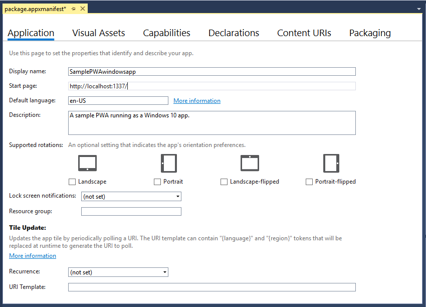
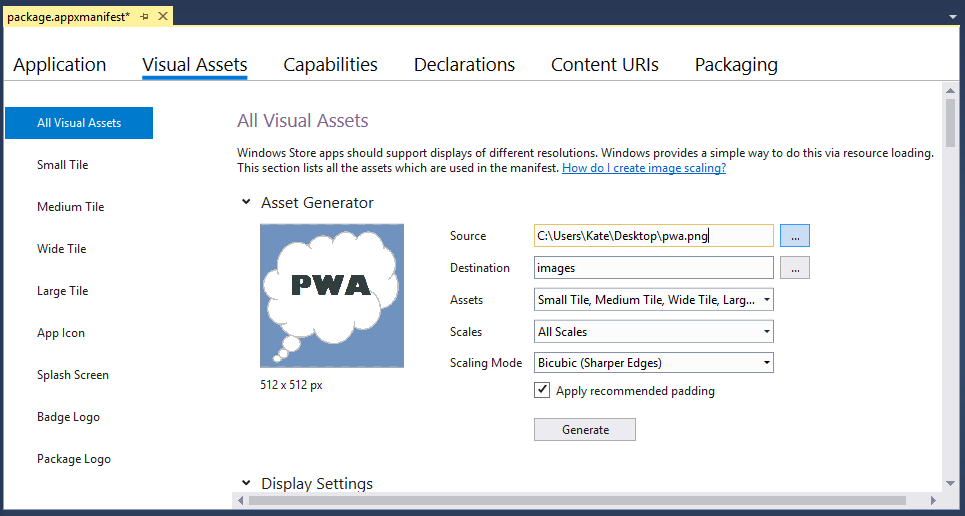
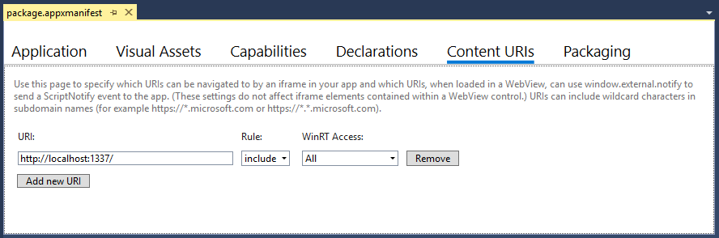
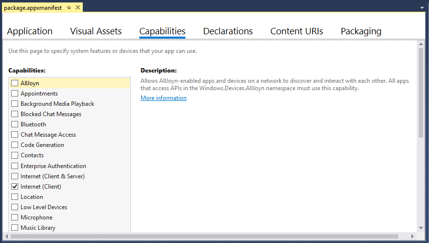
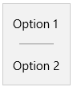

# Подгоняйте PWA (EdgeHTML) для Windows  

PwAs, установленные в [][PwaIndexWindows10] Windows 10, пользуются всеми преимуществами работы в качестве приложений универсальной платформы [Windows \(UWP\),][WindowsUWPGetStartedGuide] включая защиту с помощью безопасности песочниц приложений для Windows и полный доступ к API среды запуска [Windows (WinRT\)),][UwpApiIndex] включая API для:  

*   Управление функциями устройства \(например, камерой, микрофоном, GPS\)  
*   Доступ к пользовательским ресурсам \(например, календарю, контактам, документам, музыке\)  
*   Запуск и навигация по приложению с помощью голосовых команд Кортаны  
*   Интеграция с ос Windows \(через Центр действий Windows, панель задач рабочего стола и контекстные меню\)  
    
Это лишь некоторые из добавленных возможностей для PWA \(EdgeHTML\) в Windows.  

В этой статье показано, как установить, запустить и улучшить PWA \(EdgeHTML\) как приложение для Windows 10, обеспечивая совместимость между браузерами и кроссплатформенами.  

> [!IMPORTANT]
> Примеры и действия в этой статье требуют Visual Studio 2017. Visual Studio 2019 не включает шаблон, используемый в этой статье. Чтобы скачать Visual Studio 2017, см. Visual Studio [Downloads - 2017, 2015 & Previous Versions][PreviousVSDownloads]  


## Предварительные условия  

*   Существующий веб-клиент PWA (или веб-приложение для узла\), сайт live или localhost.  В этом руководстве используется пример PWA из ["Начало работы с "Прогрессивной веб-приложениями".][PwaGetStarted]  
*   Скачайте файл \(free\) [Visual Studio Community 2017.][MicrosoftVisualStudio|::ref1::|]  Вы также можете использовать выпуски Professional, Enterprise или [Preview.][MicrosoftVisualStudioPreview]  В установщике Visual Studio выберите следующие рабочие нагрузки:  
    *   **Разработка универсальной платформы Windows**  
        
## Настройка и запуск универсального приложения для Windows  

PWA \(EdgeHTML\), установленный как приложение для Windows 10, запускается независимо от браузера в отдельном окне \( `WWAHost.exe` процесс\).  Для этого просто требуется облегченная оболочка приложения, содержащая размещенную веб-приложение, которую можно быстро настроить с помощью шаблона Visual Studio `Progressive Web App (Universal Windows)` проекта.  \(Вся логика приложения, включая отправку исходных запросов API времени работы Windows, по-прежнему происходит в исходном коде веб-приложения.\)  

Настройка среды разработки приложений для Windows в Visual Studio.  

1.  В параметрах Windows включите [режим разработчика.][WindowsUWPGetStartedEnable]  \(Введите `developer mode` на панели поиска Windows, чтобы найти его.\)  
1.  Запустите Visual Studio и выберите **"Создать новый проект"...**  
1.  Выберите **универсальный javascript**для Windows и выберите  >  **** **"Прогрессивное веб-приложение (универсальные** приложения для Windows) в списке типов проектов Visual Studio 2017.  
1.  Выберите Windows 10 по умолчанию `Target version` \(самый последний выпуск\) и `Minimum version` \(сборка 10586 или выше\) и выберите **"ОК".**  
    
      
    
    Новый проект загружается с открытым конструктором package.appxmanifest.  Здесь вы настраиваете сведения о приложении, включая удостоверение пакета, зависимости пакета, необходимые возможности, визуальные элементы и точки возможности.  Это легко настраиваемая временная версия манифеста пакета приложения, используемая во время разработки приложения.  
    При создании проекта приложения [][UwpSchemasAppxpackageUapmanifestschemaGeneratePackageManifest] Visual Studio создает AppxManifest.xmlиз этих метаданных, который используется для установки и запуска приложения.  Каждый раз при обновлении файла обязательно перестраивать проект, чтобы оба они были отражены в `package.appxmanifest` вашей `AppxManifest.xml` времени работы.  
    
1.  В панели приложения конструктора **манифестов** введите URL-адрес PWA в качестве `Start page` .
    
    > [!NOTE]
    > Службы поддерживаются для всех URL-адресов https \(secure, remote\), указанных как `StartPage` .  Рабочие службы не поддерживаются по умолчанию для веб-приложений, которые указывают локализованную начните страницу.  Чтобы включить поддержку рабочих служб в этих случаях, добавьте в манифест явную запись [ApplicationContentUriRules,](#set-application-content-uri-rules-acurs) например: `<uap:Rule Match="http://web-platform.test/" Type="include" uap5:ServiceWorker="true"/>`  
    
      
    
    Вы также можете изменять параметры и изменять `Display name` их `Description` так, как хотите.  
1.  Сохраните этот файл \(или другое изображение размером 512x512 по вашему выбору) на рабочий стол.  
    Затем в панели **** визуальных активов конструктора манифестов нажмите кнопку "Поле...", выберите его в качестве источника и нажмите `Source` кнопку **"Создать".** ****  \(Затем нажмите **кнопку "ОК",** чтобы переписать изображения-замещитель по умолчанию\).  
    
      
    
    Это создает основные визуальные ресурсы для установки, запуска, запуска и распространения приложения в Магазине.  
    Если вы видите какие-либо красные \( \) ошибки, указывающие отсутствующие изображения, вы можете нажать кнопки ..., чтобы вручную выбрать файл из `X` созданных изображений. ****  
1.  В панели **ОКРИС** контента конструктора манифеста замените расположение `http://example.com` PWA `Rule`  =  `include` (например, `WinRT Access`  =  `All` "\").  
    Это дает вашему PWA разрешение на отправку собственный API-запросов windows \(WinRT\) при запуске в качестве приложения для Windows 10, которое будет охвачено немного позже.   Если вашему PWA не требуется доступ WinRT, вы можете переключить значение на `WinRT Access` `None` .  В любом случае не забудьте угрузить строку по умолчанию с помощью URI PWA, иначе приложение не сможет должным образом загрузиться `http://example.com` во время работы.  
    Вы готовы запустить и отладить PWA в качестве приложения для Windows 10.  Если вы используете сайт localhost для пошаговой работы с этим руководством, убедитесь, что он запущен.  Затем,  
1.  Сборка \( `Ctrl` + `Shift` + `F5` \) и запуск \( `F5` \) проекта PWA.  Теперь веб-сайт должен запускаться в окне автономных приложений.  Это не только веб-приложение, которое находится в окнах; он работает как прогрессивное веб-приложение, установленное в Windows 10!  
    
      
    
## Отлагивание PWA \(EdgeHTML\) в качестве приложения для Windows  

Так как PWA \(EdgeHTML\) — это просто постепенно улучшенное веб-приложение с расширенными службами, вы можете отлагоерировать серверный код так же, как и любое веб-приложение, используя обычную IDE и рабочий процесс.  Изменения, которые вы развертываете в прямом развертывании, отражаются в установленной веб-версии PWA при следующем запуске приложения \(нет необходимости развертывать пакет универсального приложения для Windows\).

Для клиентской отладки в приложении для Windows 10 необходимо иметь `Microsoft Edge DevTools Preview` приложение.  Это самостоятельное приложение включает в себя все функции исходного браузера [Microsoft Edge DevTools][DevToolsGuide] \(включая средства [PWA\),][DevToolsGuideServiceWorkers]а также базовую поддержку удаленной отладки и средства выбора цели отладки для подключений к любому запущенного экземпляра обдвижка EdgeHTML, включая надстройки для Office, Кортаны, веб-просмотры приложений и, конечно, PWAS, работающие в Windows. [][DevToolsProtocol01ClientsEdgePreview] [][DevToolsGuideMicrosoftStoreApp]  

Вот как настроить отладку для PWA \(EdgeHTML\).  

1.  Установите приложение [Microsoft Edge DevTools Preview][MicrosoftStoreEdgeDevtoolsPreview] из Microsoft Store, если оно еще не доступно.  
1.  После запуска сайта PWA запустите приложение DevTools.  
1.  В Visual Studio запустите приложение для Windows 10 с помощью `Start Without Debugging` команды ( `Ctrl` + `F5` ).  \(Приложение DevTools не присоединяется должным образом, Visual Studio отладка активна.\)  
1.  В приложении DevTools нажмите кнопку **"Обновить"** в выборе цели локальной отладки.  Теперь должен быть указан сайт PWA \(EdgeHTML\).  \(Если он также работает в окне браузера, это последний экземпляр этого сайта в списке.\)  
1.  Щелкните описание сайта PWA \(EdgeHTML\), чтобы открыть новую вкладку экземпляра DevTools и начать отладку.  
    
      
    
1.  Вы можете убедиться, что DevTools присоединен к вашему приложению PWA, запущенного как Windows.  В консоли DevTools **** введите:  
    
    ```shell
    window.Windows
    ```  
    
    Возвращает глобальный объект, содержащий все пространства имен `Windows Runtime` [WinRT верхнего уровня.](#find-windows-runtime-winrt-apis)  Это ваша точка входа PWA \(EdgeHTML\) для универсальной платформы [Windows][WindowsUWPIndex]и доступная только для веб-приложений, работающих как приложения для Windows 10 (запущенные за пределами браузера в `WWAHost.exe` процессе).  
    
## Поиск API-api для windows Runtime (WinRT)  

В качестве установленного приложения для Windows ваше [приложение PWA \(EdgeHTML\)][WindowsRuntime]имеет полный доступ к собственный API-api времени работы Windows; определите, что необходимо использовать, получите необходимые разрешения и используйте обнаружение функций для отправки этого запроса API в поддерживаемых средах.  Пройдите этот процесс, чтобы добавить прогрессивное улучшение для пользователей компьютеров с Windows в PWA.  

Существует несколько способов определения API универсальной платформы Windows, необходимых для Windows PWA, включая поиск в комплексных [документы UWP в Центре разработчиков для Windows][uwp/api/], скачивание и запуск примеров кода [UWP](#uwp-code-samples) с помощью Visual Studio и просмотр фрагментов кода для распространенных задач для PWAS в Windows.

Существует несколько способов определения API универсальной платформы Windows, необходимых для Windows PWA, включая поиск в комплексных [документы UWP в Центре разработчиков Windows][uwp/api/], скачивание и запуск примеров кода [UWP](#uwp-code-samples) с помощью Visual Studio и просмотр фрагментов кода для распространенных задач для PWAS в [Windows 10 (EdgeHTML).][PwaIndexWindows10]  

В целом API WinRT работают в JavaScript так же, как в C#, поэтому вы можете следовать общей документации универсальной платформы [Windows][WindowsUWPIndex] и [справочнику по API][UwpApiIndex] для использования.  Однако обратите внимание на следующие различия:  

*   Функции WinRT в JavaScript используют  [различные соглашения о casing][ScriptingJsinrtUsingWinRTCasingConventions]  
*   [События представлены в качестве идентификаторов строк,][ScriptingJsinrtHandlingWinRTEvents] переданных в методы `addEventListener` / `removeEventListener` класса  
*   [Асинхронные методы][ScriptingJsinrtUsingWinRT] используют модель JavaScript Promise  
*   API в пространстве имен не поддерживаются для приложений JavaScript, которые вместо этого используют стек веб-отрисовки ядер `Windows.UI.Xaml` [EdgeHTML][DevGuideWhatsNew] \(HTML, CSS\)  
    
Дополнительные сведения см. [в сведениях об использовании точки запуска Windows в JavaScript.][WindowRuntimeUsingJavascript]  

### Примеры кода UWP  

Ознакомьтесь с репопиторием примеров кода универсальной платформы [Windows \(UWP\),][MicrosoftDeveloperWindowsSamples] чтобы просмотреть примеры JavaScript для распространенных сценариев приложений для Windows 10.  Хотя в версиях JS этих примеров для структуры шаблона используется библиотека [WinJS,][GithubWinjsWinjs] WinJS не требуется для отправки запросов API WinRT, продемонстрированных в этих примерах.  

> [!NOTE]
> Если вам нужно прослушать событие для приложения, это можно сделать с помощью следующего native [`activated`][UwpApiWindowsUiWebuiWebapplicationActivated] API WinRT:  
> 
> **Используйте этот**  
> 
> ```javascript
> Windows.UI.WebUI.WebUIApplication.addEventListener("activated", function (activatedEventArgs) {
>     // Check activatedEventArgs.kind and respond as needed
> });
> ```  
> 
> ... в отличие от этого типа запроса WinJS, используемого в примерах:  
> 
> **Не это**  
> 
> ```javascript
>     var page = WinJS.UI.Pages.define("/html/scenario1-launched.html", {
>         ready: function (element, options) {
>             // Check options.activationKind and respond as needed
>         }
>     });
> ```  

## Отправка запросов API WinRT из PWA (EdgeHTML)  

На этом этапе представьте, что хотите добавить пользовательское контекстное меню для пользователей Windows нашего PWA \(EdgeHTML\) и определили API, необходимые в пространстве имен [Windows.UI.Popups.][UwpApiWindowsUiPopups]  

Чтобы отправлять запросы API WinRT от нашего PWA \(EdgeHTML\), сначала необходимо установить необходимые разрешения [](#set-application-content-uri-rules-acurs) \(или, Правила URI содержимого приложения\) в файле манифеста пакета приложения для Windows \( `.appxmanifest` \).  

Если любой из этих запросов API включает доступ к пользовательским ресурсам, таким как изображения или [](#app-capability-declarations) музыка, или к функциям устройства, таким как камера или микрофон, вам также необходимо добавить объявления возможностей приложения в манифест пакета приложения, чтобы Windows запрашивала у пользователя разрешение.  Если позднее вы опубликуйте PWA \(EdgeHTML\) [][MicrosoftSupportWindowsAppPermissions] в Microsoft Store, эти необходимые разрешения приложения также будут отмечены в вашем магазине.  

#### Настройка правил URI содержимого приложения (ACURs)  

С помощью ACURs, также известного как список допустимых URL-адресов, можно предоставить URL-адреса PWA \(EdgeHTML\) прямой доступ к API-api времени работы Windows.  На уровне ОС Windows установлены правильные границы политики, позволяющие коду, на веб-сервере, отправлять запросы API платформы напрямую.  Эти границы определяются в файле манифеста пакета приложения при указании URL-адресов PWA как `ApplicationContentUriRules` .  

Ваши правила должны включать начните страницу для вашего приложения и любые другие страницы, которые вы хотите включить в качестве страниц приложения.  Если пользователь переходит на URL-адрес, не включенный в правила, Windows открывает целевой URL-адрес в браузере Microsoft Edge, а не в окне \(EdgeHTML\) окна \( `WWAHost.exe` процесс\).  Вы также можете исключить определенные URL-адреса.  

Существует несколько способов указать URL-адрес `Match` в правилах:  

*   Точное имя узла  
*   Имя узла, для которого включен или исключен универсальный код ресурса (URI) со всеми поддоменами этого имени узла  
*   Точный URI  
*   Точный URI, содержащий свойство запроса  
*   Частичный путь и подстановочный знак для указания конкретного расширения файлов  
*   Относительные пути для правил исключения  
    
Вот несколько примеров ACU В `.appxmanifest` файле:  

```xml
<Application
Id="App"
StartPage="https://contoso.com/home">
<uap:ApplicationContentUriRules>
    <uap:Rule Type="include" Match="https://contoso.com/" WindowsRuntimeAccess="all" />
    <uap:Rule Type="include" Match="https://*.contoso.com/" WindowsRuntimeAccess="all" />
    <uap:Rule Type="exclude" Match="https://contoso.com/excludethispage.aspx" />
</uap:ApplicationContentUriRules>
```  

URL-адреса, определенные в ACU для вашего приложения, могут быть предоставлены разрешения для времени работы Windows с помощью атрибута, который принимает `WindowsRuntimeAccess` следующие значения:  

*   `all`: удаленный код JavaScript имеет доступ ко всем API WinRT и всем локальным упакованным компонентам.  Пространство [имен Windows \(WinRT\))][UwpApiIndex] внедряется и присутствует в движке скрипта.  
*   `allowForWeb`: доступ к удаленному коду JavaScript ограничен локальными упакованным компонентами, включая настраиваемые компоненты C++/C#.  
*   `none`: По умолчанию.  Указанный URL-адрес не получает доступ к платформе.  
    
В этом руководстве вы уже настроили единственный ACUR, необходимый вам (шаг 6 предыдущей статьи "Настройка и запуск раздела приложения"\) для одно стрежного приложения. [](#set-up-and-run-your-universal-windows-app)  Это можно подтвердить с панели **ОКРИС** контента Visual Studio `package.appxmanifest` конструктора.  

  

Вы также можете просмотреть необработанные XML манифеста, щелкнув правой кнопкой мыши файл в обозревателе решений Visual Studio и выбрав код представления `package.appxmanifest` \( **** `F7` \).  Чтобы вернуться к представлению конструктора, выберите **"Конструктор представлений"** \( `Shift` + `F7` \).  

#### Объявления возможностей приложения  

Если вашему приложению требуется программный доступ к пользовательским ресурсам, например изображениям или музыке, или к таким устройствам, как камера или микрофон, необходимо включить соответствующие объявления возможностей [приложения][WindowsUwpPackagingAppCapabilities] в файл манифеста пакета приложения.  Ниже приводятся три категории объявления возможностей приложения.  

*   [Возможности общего применения][WindowsUwpPackagingAppCapabilitiesGeneralUse], которые используются в большей части сценариев приложений.  
*   [Возможности устройства][WindowsUwpPackagingAppCapabilitiesDevice], которые позволяют вашему приложению получать доступ к периферийным и внутренним устройствам.  
*   [Специальные возможности, которые поддерживают][WindowsUwpPackagingAppCapabilitiesSpecialRestricted] корпоративные сценарии и требуют учетной записи компании Microsoft Store.  Подробнее об учетных записях компаний см. в разделе [Типы, доступность и стоимость учетных записей][WindowsUwpPublishAccountTypesLocationsFees].
    
На странице приложения Microsoft Store перечислены все возможности, объявленные в манифесте пакета приложения, поэтому укажите только возможности, которые фактически использует ваше приложение.

Некоторые возможности предоставляют приложениям доступ к конфиденциальным ресурсам.  Эти ресурсы считаются конфиденциальными, так как каждый из них может получить доступ к персональным данным пользователя или стоить пользователю денег.  Параметры конфиденциальности, управляемые приложением «Параметры Windows [10».][BingResultsWindows10Settings] Позволяет пользователю динамически управлять доступом к конфиденциальным ресурсам.  Таким образом, важно, чтобы ваше приложение не предполагалось, что конфиденциальный ресурс всегда доступен.  Подробнее о доступе к конфиденциальным ресурсам см. в разделе [Руководство по приложениям, учитывающим требования конфиденциальности][WindowsUwpSecurityIndex].  

Вы запрашиваете доступ, объявляя возможности в манифесте пакета для вашего приложения.  В Visual Studio это можно сделать с помощью **** панели возможностей конструктора package.appxmanifest.  

  

В этом руководстве требуется только возможность Интернета по умолчанию \(Client\), поэтому никаких дополнительных действий не требуется.  

### Использование обнаружения функций для вызова WinRT  

Чтобы обеспечить базовый уровень качества для аудитории PWA на всех платформах, постепенно улучшайте возможности PWA в Windows с помощью функций обнаружения WinRT.  Таким образом вы сможете убедиться, что ваш код для Windows работает только в том контексте, где доступны и применимы API WinRT.  

Обнаружение функций может быть таким же простым, как поиск объекта \(точки входа в пространство имен `Windows` [WinRT][UwpApiIndex]\), как по приведенной ниже таблице:  

```javascript
if(window.Windows){
    /*Run code that sends Windows API requests */
}
```  

Однако, учитывая, что не все API Windows доступны на всех типах устройств [с Windows 10,][UwpExtensionSdkDeviceFamiliesOverview]обычно полезно использовать более конкретное обнаружение функций для дальнейшей квалификации пространства имен отправляемого запроса API:  

```javascript
if(window.Windows && Windows.Media.SpeechRecognition){
    /*Run code that sends Windows API requests */
}
```  

В этом фоновом режиме можно добавить код WinRT для реализации пользовательского контекстного меню.  Если вы используете пример PWA из ["Начало работы с прогрессивной веб-приложениями":][PwaGetStarted]

1.  Откройте Visual Studio в проекте сайта PWA.  
1.  В обозревателе решений откройте файл и добавьте следующую строку прямо под ссылкой `views\layout.pug` `script` для рабочего сотрудника службы:
    
    ```xml
    script(src='/javascripts/site.js')
    ```  
    
1.  В обозревателе решений щелкните правой кнопкой мыши папку и `javascripts` **добавьте**  >  **новый файл...**
1.  Назовите файл и `site.js` скопируйте следующий код:
    
    ```javascript
    if (window.Windows && Windows.UI.Popups) {
        document.addEventListener('contextmenu', function (e) {

            // Build the context menu
            var menu = new Windows.UI.Popups.PopupMenu();
            menu.commands.append(new Windows.UI.Popups.UICommand("Option 1", null, 1));
            menu.commands.append(new Windows.UI.Popups.UICommandSeparator);
            menu.commands.append(new Windows.UI.Popups.UICommand("Option 2", null, 2));

            // Convert from webpage to WinRT coordinates
            function pageToWinRT(pageX, pageY) {
                var zoomFactor = document.documentElement.msContentZoomFactor;
                return {
                    x: (pageX - window.pageXOffset) * zoomFactor,
                    y: (pageY - window.pageYOffset) * zoomFactor
                };
            }

            // When the menu is invoked, execute the requested command
            menu.showAsync(pageToWinRT(e.pageX, e.pageY)).done(function (invokedCommand) {
                if (invokedCommand !== null) {
                    switch (invokedCommand.id) {
                        case 1:
                            console.log('Option 1 selected');
                            // Invoke code for option 1
                            break;
                        case 2:
                            console.log('Option 2 selected');
                            // Invoke code for option 2
                            break;
                        default:
                            break;
                    }
                } else {
                    // The command is null if no command was invoked.
                    console.log("Context menu dismissed");
                }
            });
        }, false);
    }
    ```
    
1.  Сравните поведение контекстного меню при запуске PWA в браузере \( из проекта сайта PWA\) и из окна приложения для Windows \( из проекта универсального приложения `F5` `F5` для Windows\).  В браузере щелчок правой кнопкой мыши предоставляет контекстное меню Microsoft Edge по умолчанию, тогда как в этом процессе теперь отображается `WWAHost.exe` пользовательское меню.  
    
    | Microsoft Edge | Приложение для Windows 10 |  
    |:--- |:---- |  
    |  |  |  
    
Надеемся, что теперь у вас есть прочная основа для постепенного улучшения ваших PWAs в Windows.  Если у вас возникают вопросы или что-либо неизвестно, отправьте комментарий!  

## Дальнейшая работа

Центр [разработки для Windows][MicrosoftDeveloperWindowsApps] — это полная справка [][MicrosoftDeveloperWindowsAppsGetStarted]по всем этапам [][MicrosoftDeveloperWindowsAppsDevelop]создания приложений [][MicrosoftDeveloperStorePublishApps] для Windows, от начала работы до [проектирования,][MicrosoftDeveloperWindowsAppsDesign]разработки и публикации в Microsoft Store.  

Общие сведения о универсальной платформе Windows (UWP)и о том, как нацелить разные семейства устройств с Windows 10, см. в обзоре универсальной платформы [Windows.][WindowsUWPGetStartedGuide]  

Когда вы будете готовы, вот как \(и почему!\) отправить [PWA в Microsoft Store.](./microsoft-store.md)  

<!-- links -->  

[PwaGetStarted]: ./get-started.md "Начало работы с последовательными веб-приложениями | Документы Майкрософт"  
[PwaIndexWindows10]: ./index.md#pwas-on-windows-10-edgehtml "PWAs в Windows 10 (EdgeHTML) — прогрессивное веб-приложение в Windows | Документы Майкрософт"  
[DevToolsGuide]: ../devtools-guide/index.md "Средства разработчика Microsoft Edge (EdgeHTML) | Документы Майкрософт"  
[DevToolsGuideMicrosoftStoreApp]: ../devtools-guide/index.md#microsoft-store-app "Приложение Microsoft Store — Средства разработчика Microsoft Edge (EdgeHTML) | Документы Майкрософт"  
[DevToolsGuideServiceWorkers]: ../devtools-guide/service-workers.md "Service Workers | Документы Майкрософт"  
[DevToolsProtocol01ClientsEdgePreview]: ../devtools-protocol/0.1/clients.md#microsoft-edge-devtools-preview "Microsoft Edge DevTools Preview — клиенты протокола DevTools | Документы Майкрософт"  
[DevGuideWhatsNew]: ../dev-guide/whats-new.md "Новые возможности EdgeHTML | Документы Майкрософт"  
[WindowsRuntime]: ../windows-runtime/index.md "Windows Runtime (WinRT) для JavaScript | Документы Майкрософт"  
[WindowRuntimeUsingJavascript]: ../windows-runtime/using-the-windows-runtime-in-javascript.md "Использование точки запуска Windows в JavaScript | Документы Майкрософт"  

[ScriptingJsinrtHandlingWinRTEvents]: /scripting/jswinrt/handling-windows-runtime-events-in-javascript "Обработка событий времени работы Windows в JavaScript | Документы Майкрософт"  
[ScriptingJsinrtUsingWinRT]: /scripting/jswinrt/using-windows-runtime-asynchronous-methods "Использование асинхронных методов в windows Runtime | Документы Майкрософт"  
[ScriptingJsinrtUsingWinRTCasingConventions]:  /scripting/jswinrt/using-the-windows-runtime-in-javascript#casing-conventions-with-windows-runtime-features "Соглашения casing с функциями времени работы Windows — использование точки запуска Windows в JavaScript | Документы Майкрософт"  
[UwpApiIndex]: /uwp/api/index "Пространства имен UWP windows | Документы Майкрософт"  
[UwpApiWindowsUiPopups]: /uwp/api/windows.ui.popups "Пространство имен Windows.UI.Popups | Документы Майкрософт"  
[UwpApiWindowsUiWebuiWebapplicationActivated]: /uwp/api/windows.ui.webui.webuiapplication.activated "WebUIApplication.Activated Event | Документы Майкрософт"  
[UwpExtensionSdkDeviceFamiliesOverview]: /uwp/extension-sdks/device-families-overview "Общие сведения о семействах устройств | Документы Майкрософт"  
[UwpSchemasAppxpackageUapmanifestschemaGeneratePackageManifest]: /uwp/schemas/appxpackage/uapmanifestschema/generate-package-manifest "Как Visual Studio манифест пакета приложения | Документы Майкрософт"  
[WindowsUWPIndex]: /windows/uwp/index "Документация по универсальной платформе Windows | Документы Майкрософт"  
[WindowsUWPGetStartedGuide]: /windows/uwp/get-started/universal-application-platform-guide "Что такое приложение универсальной платформы Windows (UWP)? | Документы Майкрософт"  
[WindowsUWPGetStartedEnable]: /windows/uwp/get-started/enable-your-device-for-development "Включить разработку устройства | Документы Майкрософт"  
[WindowsUwpSecurityIndex]: /windows/uwp/security/index "Безопасность | Документы Майкрософт"  
[WindowsUwpPublishAccountTypesLocationsFees]: /windows/uwp/publish/account-types-locations-and-fees "Типы, расположения и стоимость учетных записей | Документы Майкрософт"  
[WindowsUwpPackagingAppCapabilitiesSpecialRestricted]: /windows/uwp/packaging/app-capability-declarations#special-and-restricted-capabilities "Ограниченные возможности | Документы Майкрософт"  
[WindowsUwpPackagingAppCapabilitiesDevice]: /windows/uwp/packaging/app-capability-declarations#device-capabilities "Возможности устройства | Документы Майкрософт"  
[WindowsUwpPackagingAppCapabilitiesGeneralUse]: /windows/uwp/packaging/app-capability-declarations#general-use-capabilities "Возможности общего использования | Документы Майкрософт"  
[WindowsUwpPackagingAppCapabilities]: /windows/uwp/packaging/app-capability-declarations "Объявления возможностей приложения | Документы Майкрософт"  

[BingResultsWindows10Settings]: https://binged.it/2lOGSH0 "параметры Windows 10 — Bing"  
[GithubWinjsWinjs]: https://github.com/winjs/winjs "winjs/winjs | GitHub"  
[MicrosoftDeveloperStorePublishApps]: https://developer.microsoft.com/store/publish-apps/index "Публикация приложений и игр для Windows"  
[MicrosoftDeveloperWindowsApps]: https://developer.microsoft.com/windows/apps/index "Документация по универсальной платформе Windows"  
[MicrosoftDeveloperWindowsAppsDesign]: https://developer.microsoft.com/windows/apps/design/index "Проектирование и код приложений для Windows"  
[MicrosoftDeveloperWindowsAppsDevelop]: https://developer.microsoft.com/windows/apps/develop/index "Разработка приложений UWP"  
[MicrosoftDeveloperWindowsAppsGetStarted]: https://developer.microsoft.com/windows/apps/getstarted/index "Начало работы с приложениями для Windows 10"  
[MicrosoftDeveloperWindowsSamples]: https://developer.microsoft.com/windows/samples "Примеры кода"  
[MicrosoftStoreEdgeDevtoolsPreview]: https://www.microsoft.com/store/p/microsoft-edge-devtools-preview/9mzbfrmz0mnj "Предварительная версия Microsoft Edge DevTools"  
[MicrosoftSupportWindowsAppPermissions]: https://support.microsoft.com/help/10557/windows-10-app-permissions "Разрешения для приложений"  
[MicrosoftVisualStudioDownloads]: https://visualstudio.microsoft.com/downloads "Загрузки"  
[MicrosoftVisualStudioPreview]: https://visualstudio.microsoft.com/vs/preview "Visual Studio Preview"  
[PreviousVSDownloads]: https://visualstudio.microsoft.com/vs/older-downloads/ "Visual Studio загрузки"  
